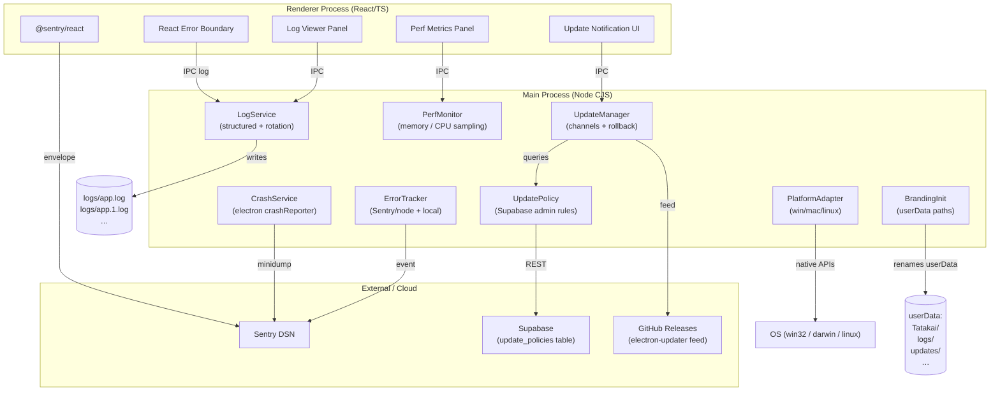
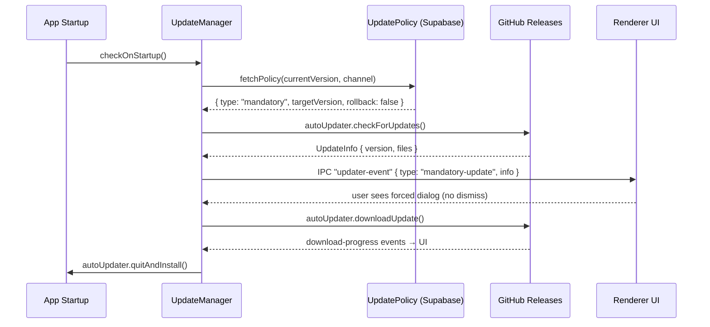
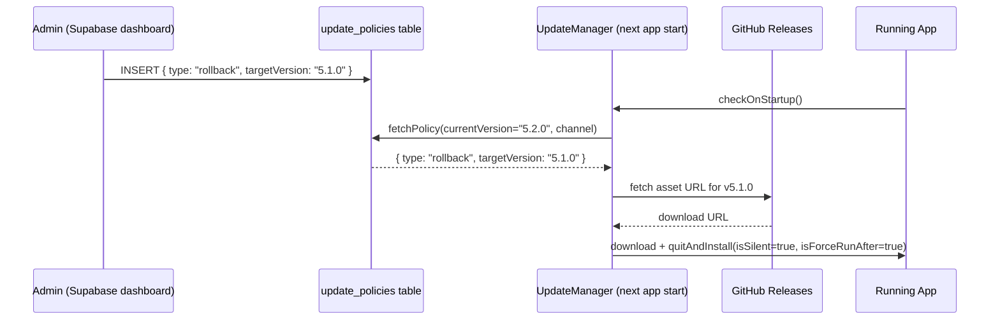
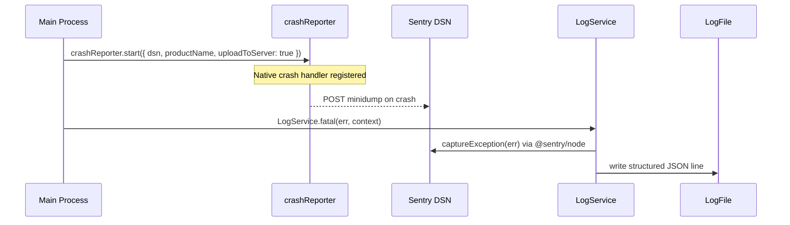

# Design Document: Electron Production Readiness

## Overview

This feature transforms the Tatakai Electron application from a functional desktop app into a
fully production-hardened product. It covers six interconnected pillars: structured logging
and diagnostics, crash reporting and error tracking, app health and performance monitoring,
cross-platform native behaviour, consistent Tatakai branding throughout all storage paths and
identifiers, and a complete admin-controlled update management system with mandatory/optional/
experimental channels and rollback support.

The existing codebase already has a minimal synchronous logger (`desktop/logger.cjs`) with a
single 5 MB rotation, a basic `electron-updater` integration in `ipc-system.cjs`, Sentry
packages installed, and `appId: "app.tatakai.me"` / `productName: "Tatakai"` in
`package.json`. This design builds on those foundations rather than replacing them, targeting
zero-regression additions that can be shipped incrementally.

---

## Architecture



---

## Sequence Diagrams

### Update Flow — Mandatory Update



### Update Flow — Rollback



### Crash Reporting Flow



---

## Components and Interfaces

### Component 1: LogService (`desktop/services/log-service.cjs`)

**Purpose**: Replaces the bare `logger.cjs` with a structured, level-aware, rotating logger.

**Interface**:
```typescript
interface LogService {
  debug(msg: string, ctx?: Record<string, unknown>): void
  info(msg: string, ctx?: Record<string, unknown>): void
  warn(msg: string, ctx?: Record<string, unknown>): void
  error(msg: string, ctx?: Record<string, unknown>): void
  fatal(msg: string, ctx?: Record<string, unknown>): void
  /** Returns path to current log file */
  getLogPath(): string
  /** Returns last N lines across all rotated files */
  tail(lines?: number): string[]
  /** Flushes pending writes and closes stream */
  close(): Promise<void>
}
```

**Responsibilities**:
- Write JSON-structured lines: `{ timestamp, level, message, context, pid, version }`
- Rotate on size threshold (default 10 MB) keeping up to 5 rotated files
- Forward `error` / `fatal` entries to ErrorTracker in the same process
- Expose `tail()` for the in-app Log Viewer IPC handler

### Component 2: CrashService (`desktop/services/crash-service.cjs`)

**Purpose**: Registers Electron's native crash reporter and surfaces breadcrumbs on restart.

**Interface**:
```typescript
interface CrashService {
  /** Call before app.on('ready'). Registers native crash reporter. */
  start(opts: { dsn: string; uploadToServer: boolean }): void
  /** Returns crash dump files from previous sessions */
  getPreviousCrashReports(): CrashReport[]
  /** Marks crash reports as acknowledged */
  clearCrashReports(): void
}

interface CrashReport {
  id: string
  date: Date
  path: string
}
```

**Responsibilities**:
- Call `crashReporter.start()` with Sentry DSN and `productName: "Tatakai"`
- On `app.on('ready')`, check `crashReporter.getLastCrashReport()` and log via LogService
- Notify renderer if a crash report exists from the previous session

### Component 3: ErrorTracker (`desktop/services/error-tracker.cjs`)

**Purpose**: Unified error capturing for both main and renderer processes via Sentry.

**Interface**:
```typescript
interface ErrorTracker {
  init(opts: { dsn: string; release: string; environment: string }): void
  captureException(err: Error, ctx?: Record<string, unknown>): void
  captureMessage(msg: string, level: 'info' | 'warning' | 'error'): void
  setUser(user: { id: string; email?: string } | null): void
  addBreadcrumb(crumb: { category: string; message: string; level: string }): void
}
```

**Responsibilities**:
- Initialize `@sentry/node` in main process with `release` set to `app.getVersion()`
- Initialize `@sentry/react` in renderer via existing Sentry packages
- Filter sensitive data (auth tokens, file paths) before sending
- Gate on user consent (opt-out setting stored in userData/settings.json)

### Component 4: PerfMonitor (`desktop/services/perf-monitor.cjs`)

**Purpose**: Periodic sampling of memory, CPU, and IPC latency for diagnostics.

**Interface**:
```typescript
interface PerfMonitor {
  start(intervalMs?: number): void
  stop(): void
  getSnapshot(): PerfSnapshot
  getHistory(lastN?: number): PerfSnapshot[]
}

interface PerfSnapshot {
  timestamp: number
  heapUsedMB: number
  heapTotalMB: number
  rss: number
  externalMB: number
  cpuUser: number
  cpuSystem: number
  rendererMemoryMB?: number
}
```

**Responsibilities**:
- Sample `process.memoryUsage()` and `process.cpuUsage()` every 30 s
- Query `getMainWindow().webContents.getProcessMemoryInfo()` for renderer memory
- Emit warning log if heap exceeds 512 MB or RSS exceeds 1 GB
- Expose history via IPC for the diagnostics panel

### Component 5: UpdateManager (`desktop/services/update-manager.cjs`)

**Purpose**: Extends the existing `electron-updater` integration with admin-controlled
channels, mandatory/optional/rollback update types, and version history tracking.

**Interface**:
```typescript
type UpdateChannel = 'stable' | 'beta' | 'experimental'
type UpdateType = 'mandatory' | 'recommended' | 'experimental' | 'rollback'

interface UpdatePolicy {
  type: UpdateType
  targetVersion: string
  channel: UpdateChannel
  publishedAt: string
  rollbackFromVersion?: string   // populated for rollback records
  notes?: string
}

interface UpdateManager {
  init(opts: { ipcMain: Electron.IpcMain; autoUpdater: AppUpdater; logger: LogService }): void
  checkForUpdates(channel?: UpdateChannel): Promise<UpdateCheckResult>
  applyPolicy(policy: UpdatePolicy): Promise<void>
  getVersionHistory(): VersionRecord[]
  rollbackTo(version: string): Promise<void>
}

interface UpdateCheckResult {
  hasUpdate: boolean
  policy: UpdatePolicy | null
  info: UpdateInfo | null
}

interface VersionRecord {
  version: string
  installedAt: string
  channel: UpdateChannel
}
```

**Responsibilities**:
- On startup, query Supabase `update_policies` table filtered by `channel` and `active = true`
- For `mandatory` policies: show blocking dialog, disallow dismissal, download + install
- For `recommended` policies: show dismissible toast; allow user to defer
- For `experimental` policies: silent background download, install on next launch
- For `rollback` policies: force-install the target version and record rollback in local history
- Persist `version-history.json` in `userData/updates/` for rollback state tracking
- Register IPC channels: `update:check`, `update:download`, `update:install`,
  `update:rollback`, `update:get-history`, `update:get-policy`

### Component 6: PlatformAdapter (`desktop/services/platform-adapter.cjs`)

**Purpose**: Abstracts OS-specific native behaviours behind a single interface.

**Interface**:
```typescript
interface PlatformAdapter {
  /** Register OS-native notification with correct icons and sounds */
  notify(opts: { title: string; body: string; urgency?: 'low' | 'normal' | 'critical' }): void
  /** Set taskbar/dock badge (number) */
  setBadgeCount(count: number): void
  /** Flash taskbar (Windows) or bounce dock (macOS) */
  requestAttention(): void
  /** Register deep-link protocol (already done; this normalises the call) */
  registerProtocol(protocol: string): void
  /** Linux: ensure .desktop file exists in ~/.local/share/applications */
  ensureDesktopEntry(): void
}
```

**Responsibilities**:
- Windows: `app.setAppUserModelId("app.tatakai.me")`, taskbar flash via
  `BrowserWindow.flashFrame()`, `Notification` API with icon
- macOS: `app.dock.setBadge()`, `app.dock.bounce()`, `Notification` API
- Linux: write `~/.local/share/applications/tatakai.desktop` on first run

### Component 7: BrandingInit (`desktop/services/branding-init.cjs`)

**Purpose**: Ensures all app storage paths use "Tatakai" naming, not generic Electron defaults.

**Interface**:
```typescript
interface BrandingInit {
  /** Call before app.on('ready'). Sets name, model ID, paths. */
  apply(app: Electron.App): void
}
```

**Responsibilities**:
- `app.setName('Tatakai')` (already done in main.cjs — centralise here)
- Windows: `app.setAppUserModelId('app.tatakai.me')`
- Ensure `app.getPath('userData')` resolves to `…/Tatakai/` not `…/Electron/`
- Ensure `app.getPath('logs')` resolves to `…/Tatakai/logs/`
- Migrate legacy `…/Electron/` userData to `…/Tatakai/` on first upgraded launch

---

## Data Models

### UpdatePolicy (Supabase table: `update_policies`)

```typescript
interface UpdatePolicyRow {
  id: string                    // UUID
  channel: UpdateChannel        // 'stable' | 'beta' | 'experimental'
  type: UpdateType              // 'mandatory' | 'recommended' | 'experimental' | 'rollback'
  target_version: string        // semver e.g. "5.3.0"
  rollback_from_version?: string // set when type === 'rollback'
  active: boolean               // false = archived / superseded
  notes?: string                // admin-facing notes
  published_at: string          // ISO timestamp
  created_by?: string           // admin user ID
}
```

**Validation Rules**:
- `target_version` must be valid semver
- Only one row with `active = true` per `channel` at a time
- `type === 'rollback'` requires `rollback_from_version !== null`

### VersionRecord (local: `userData/updates/version-history.json`)

```typescript
interface VersionRecord {
  version: string
  channel: UpdateChannel
  installedAt: string     // ISO timestamp
  source: 'fresh-install' | 'update' | 'rollback'
  previousVersion?: string
}
```

### LogLine (each line in `logs/app.log`)

```typescript
interface LogLine {
  timestamp: string        // ISO 8601
  level: 'DEBUG' | 'INFO' | 'WARN' | 'ERROR' | 'FATAL'
  message: string
  context?: Record<string, unknown>
  pid: number
  version: string          // app version
  platform: string
}
```

### PerfSnapshot (in-memory ring buffer)

```typescript
interface PerfSnapshot {
  timestamp: number        // Date.now()
  heapUsedMB: number
  heapTotalMB: number
  rssMB: number
  externalMB: number
  cpuUser: number          // microseconds since last sample
  cpuSystem: number
  rendererHeapMB?: number
  rendererRssMB?: number
}
```

---

## Algorithmic Pseudocode

### Main Algorithm: UpdateManager.checkOnStartup()

```typescript
async function checkOnStartup(channel: UpdateChannel): Promise<void> {
  // Precondition: app is ready, network may or may not be available
  const policy = await UpdatePolicy.fetch(channel).catch(() => null)

  if (policy === null) {
    // No connectivity or no active policy — fall back to standard auto-updater check
    await standardCheck()
    return
  }

  if (policy.type === 'rollback') {
    // Postcondition: app version === policy.targetVersion after relaunch
    await performRollback(policy.targetVersion)
    return
  }

  const updateInfo = await autoUpdater.checkForUpdates()
  if (!updateInfo?.updateInfo) return

  if (semver.lt(app.getVersion(), updateInfo.updateInfo.version)) {
    if (policy.type === 'mandatory') {
      // Loop invariant: renderer is blocked until download completes
      showMandatoryUpdateDialog(updateInfo.updateInfo)
      await downloadAndInstall()        // does not return; quitAndInstall() called
    } else if (policy.type === 'recommended') {
      showRecommendedUpdateToast(updateInfo.updateInfo)
    } else {
      // 'experimental' — silent background
      autoUpdater.downloadUpdate()
    }
  }
}
```

**Preconditions**:
- `app.isPackaged === true` (dev mode bypasses entirely)
- `channel` is one of `'stable' | 'beta' | 'experimental'`

**Postconditions**:
- If `policy.type === 'mandatory'`: app quits and relaunches at `targetVersion`
- If `policy.type === 'recommended'`: toast shown, no forced action
- If `policy.type === 'rollback'`: app downgrades to `targetVersion`
- `version-history.json` updated with new record on every successful install

**Loop Invariants**: N/A (no loops in main flow)

---

### Main Algorithm: LogService rotation

```typescript
function write(level: LogLevel, msg: string, ctx?: object): void {
  // Precondition: logStream is open and writable
  const line = JSON.stringify({ timestamp: new Date().toISOString(), level, message: msg,
                                 context: ctx, pid: process.pid, version: APP_VERSION })
  logStream.write(line + '\n')

  currentSizeBytes += Buffer.byteLength(line, 'utf8') + 1

  // Loop invariant: currentSizeBytes accurately reflects bytes written since last rotation
  if (currentSizeBytes >= ROTATE_THRESHOLD_BYTES) {
    rotate()
    // Postcondition: new empty log file is active, previous file renamed to app.1.log
    //                rotated files beyond MAX_FILES are deleted
  }

  if (level === 'ERROR' || level === 'FATAL') {
    ErrorTracker.captureMessage(msg, level.toLowerCase() as SentryLevel)
  }
}

function rotate(): void {
  logStream.close()
  // Shift: app.4.log → deleted, app.3.log → app.4.log, … app.log → app.1.log
  for (let i = MAX_FILES - 1; i >= 1; i--) {
    const src = logPath(i - 1)
    const dst = logPath(i)
    if (fs.existsSync(src)) fs.renameSync(src, dst)
  }
  logStream = fs.createWriteStream(logPath(0), { flags: 'a' })
  currentSizeBytes = 0
}
```

**Preconditions**:
- `ROTATE_THRESHOLD_BYTES` > 0 (default 10 × 1024 × 1024)
- `MAX_FILES` ≥ 2

**Postconditions**:
- After `rotate()`: at most `MAX_FILES` log files exist in `logs/`
- Log entries are never lost between the close of old stream and open of new

---

### Main Algorithm: PerfMonitor sampling loop

```typescript
function start(intervalMs = 30_000): void {
  // Precondition: not already started
  if (timer) return

  let lastCpu = process.cpuUsage()
  timer = setInterval(async () => {
    const mem = process.memoryUsage()
    const cpu = process.cpuUsage(lastCpu)
    lastCpu = process.cpuUsage()

    let rendererHeap: number | undefined
    const win = getMainWindow()
    if (win && !win.isDestroyed()) {
      const ri = await win.webContents.getProcessMemoryInfo()
      rendererHeap = ri.privateBytes / 1024 / 1024
    }

    const snap: PerfSnapshot = {
      timestamp: Date.now(),
      heapUsedMB: mem.heapUsed / 1024 / 1024,
      heapTotalMB: mem.heapTotal / 1024 / 1024,
      rssMB: mem.rss / 1024 / 1024,
      externalMB: mem.external / 1024 / 1024,
      cpuUser: cpu.user,
      cpuSystem: cpu.system,
      rendererHeapMB: rendererHeap,
    }

    // Loop invariant: history.length <= MAX_HISTORY_ENTRIES
    history.push(snap)
    if (history.length > MAX_HISTORY_ENTRIES) history.shift()

    if (snap.heapUsedMB > HEAP_WARN_MB) {
      logger.warn('[PerfMonitor] High heap usage', { heapUsedMB: snap.heapUsedMB })
    }
  }, intervalMs)
}
```

**Preconditions**:
- `getMainWindow` may return `null` — guarded with null check

**Postconditions**:
- `history` contains at most `MAX_HISTORY_ENTRIES` (default 120) snapshots
- High-memory conditions are logged at `WARN` level

**Loop Invariants**:
- `history.length <= MAX_HISTORY_ENTRIES` holds after every iteration

---

## Key Functions with Formal Specifications

### `UpdateManager.rollbackTo(version)`

```typescript
async function rollbackTo(version: string): Promise<void>
```

**Preconditions**:
- `semver.valid(version) !== null`
- A GitHub release asset for `version` exists (verified before calling)
- `version !== app.getVersion()` (no-op rollback guard)

**Postconditions**:
- `version-history.json` contains a new entry `{ source: 'rollback', version, previousVersion: currentVersion }`
- `app.quit()` has been called; next launch will be at `version`
- If asset download fails, error is logged and `quitAndInstall` is NOT called

---

### `BrandingInit.apply(app)`

```typescript
function apply(app: Electron.App): void
```

**Preconditions**:
- Called before `app.on('ready')` fires
- `app.isReady() === false`

**Postconditions**:
- `app.getName() === 'Tatakai'`
- On Windows: `app.getAppUserModelId() === 'app.tatakai.me'`
- `app.getPath('userData')` does not contain `'Electron'`
- If old `…/Electron/` directory exists, its contents are copied to `…/Tatakai/` exactly once

---

### `PlatformAdapter.notify(opts)`

```typescript
function notify(opts: { title: string; body: string; urgency?: 'low' | 'normal' | 'critical' }): void
```

**Preconditions**:
- `app.isReady() === true`
- `Notification.isSupported() === true`

**Postconditions**:
- A native OS notification is shown with `title` and `body`
- On Linux with `urgency = 'critical'`, `libnotify` urgency level is set to `critical`
- No exception is thrown even if notification permission is denied (errors are logged)

---

### `LogService.tail(lines?)`

```typescript
function tail(lines?: number): string[]
```

**Preconditions**:
- `lines` is a positive integer when provided; defaults to 200

**Postconditions**:
- Returns at most `lines` most-recent log lines across all rotated files
- Lines are returned in chronological order (oldest first)
- Does not throw; returns `[]` if no log files exist

---

## Example Usage

### Setting up all production services in `main.cjs`

```typescript
// Called before app.on('ready') — order matters
const { applyBranding } = require('./services/branding-init.cjs')
const { initCrashService } = require('./services/crash-service.cjs')
const { createLogService } = require('./services/log-service.cjs')
const { createErrorTracker } = require('./services/error-tracker.cjs')
const { createPerfMonitor } = require('./services/perf-monitor.cjs')
const { createUpdateManager } = require('./services/update-manager.cjs')
const { createPlatformAdapter } = require('./services/platform-adapter.cjs')

applyBranding(app)

initCrashService({ dsn: process.env.SENTRY_DSN, uploadToServer: !isDev })

const logger = createLogService({ app, maxFileSizeMB: 10, maxFiles: 5 })
const errorTracker = createErrorTracker({ logger })
errorTracker.init({ dsn: process.env.SENTRY_DSN, release: app.getVersion(),
                    environment: isDev ? 'development' : 'production' })

const perfMonitor = createPerfMonitor({ logger, getMainWindow })
const platformAdapter = createPlatformAdapter({ app, logger })
const updateManager = createUpdateManager({ ipcMain, autoUpdater, logger, app,
                                             supabaseUrl: process.env.SUPABASE_URL,
                                             supabaseKey: process.env.SUPABASE_ANON_KEY })

app.on('ready', () => {
  perfMonitor.start()
  platformAdapter.ensureDesktopEntry()   // Linux only; no-op on other platforms
  updateManager.checkOnStartup('stable')
})
```

### Admin creating a mandatory update policy (Supabase SQL)

```sql
-- Deactivate previous policy for stable channel
UPDATE update_policies SET active = false WHERE channel = 'stable' AND active = true;

-- Insert new mandatory update
INSERT INTO update_policies (channel, type, target_version, active, notes, published_at)
VALUES ('stable', 'mandatory', '5.3.0', true, 'Critical security fix', now());
```

### Admin triggering a global rollback

```sql
INSERT INTO update_policies (channel, type, target_version, rollback_from_version, active, notes, published_at)
VALUES ('stable', 'rollback', '5.1.0', '5.2.0', true, 'Reverting broken 5.2.0 release', now());
```

---

## Correctness Properties

*A property is a characteristic or behaviour that should hold true across all valid executions
of the system — a formal statement about what the software must do. Properties serve as the
bridge between human-readable specifications and machine-verifiable correctness guarantees.*

### Property 1: Log Rotation File-Count Invariant

For any sequence of log write operations with arbitrary message sizes, if the cumulative bytes
written since the last rotation exceeds `ROTATE_THRESHOLD_BYTES`, then the log is rotated
before the next write and at most `MAX_FILES` log files exist afterward.

**Validates: Requirements 1.3, 1.4**

### Property 2: No Silent Log Loss

For every call to `LogService.write()`, the log line either appears in the current log file
or in a rotated file — it is never silently discarded, even across rotation boundaries.

**Validates: Requirements 1.1, 1.2**

### Property 3: Mandatory Update Blocks Interactive State

For any app state where `UpdatePolicy.type === 'mandatory'` and
`semver.lt(currentVersion, policy.targetVersion)`, the app does not enter a fully interactive
state without either completing the update install or explicitly failing and notifying the user.

**Validates: Requirements 5.2, 5.3**

### Property 4: Rollback to Current Version is a No-Op

For any call to `UpdateManager.rollbackTo(version)` where `version === app.getVersion()`,
`version-history.json` is not modified and `app.quit()` is not called.

**Validates: Requirements 5.8**

### Property 5: userData Path Never Contains 'Electron'

For any call to `BrandingInit.apply(app)`, after the app becomes ready,
`app.getPath('userData')` does not contain the string `'Electron'`.

**Validates: Requirements 7.3**

### Property 6: Telemetry Consent Gate

For any call to `ErrorTracker.captureException()` or `ErrorTracker.captureMessage()`, if the
user's `userData/settings.json` contains `{ "telemetry": false }`, no data is sent to Sentry.

**Validates: Requirements 3.5, 9.2**

### Property 7: PerfMonitor History Bound

For all times t and any N append operations, `history.length <= MAX_HISTORY_ENTRIES` holds
after every iteration. The in-memory PerfMonitor snapshot history never exceeds
`MAX_HISTORY_ENTRIES` (120) entries.

**Validates: Requirements 4.4**

### Property 8: PlatformAdapter.notify() Never Throws

For any call to `PlatformAdapter.notify()` on any supported platform (win32, darwin, linux),
including when notification permission is unavailable or denied, no uncaught exception is
thrown.

**Validates: Requirements 6.10**

### Property 9: Channel Isolation

For any device subscribed to channel `'stable'`, all update policies applied by
UpdateManager are exclusively from the `'stable'` channel. A stable device never receives a
policy intended for `'experimental'` or `'beta'`.

**Validates: Requirements 5.16**

### Property 10: Version History is Append-Only

For any sequence of install and rollback events, entries in `version-history.json` are never
deleted or modified — only appended. The record count only ever increases.

**Validates: Requirements 5.10, 5.11**

### Property 11: Sentry Sensitive Data Scrubbing

For any error event that contains strings matching filesystem path patterns or JWT token
formats, the event transmitted to Sentry must not contain those strings after the `beforeSend`
hook processes it.

**Validates: Requirements 3.4, 9.1**

### Property 12: BrandingInit Migration Idempotence

For any number of calls to `BrandingInit.apply(app)`, the legacy `Electron/` userData
migration is performed at most once. Subsequent calls do not re-migrate or overwrite existing
files in the `Tatakai/` directory.

**Validates: Requirements 7.5, 7.6, 7.8**

---

## Error Handling

### Scenario 1: Network unavailable at update check

**Condition**: Supabase or GitHub Releases is unreachable at startup  
**Response**: `checkOnStartup()` catches the network error, logs at `WARN`, and silently skips
the update check. The app starts normally.  
**Recovery**: Next launch retries. No user-facing error is shown unless the update was mandatory
and the error persists for more than 3 consecutive launches (grace period), after which a
toast informs the user.

### Scenario 2: Log file write failure

**Condition**: `fs.appendFileSync` throws (disk full, permissions error)  
**Response**: Logger catches the error, prints to `console.error`, and continues. Subsequent
writes also attempt the file but do not crash the process.  
**Recovery**: Error is surfaced in the in-app Log Viewer as a system warning. User is prompted
to check disk space.

### Scenario 3: Crash reporter DSN missing

**Condition**: `SENTRY_DSN` env var is empty or undefined  
**Response**: `CrashService.start()` skips `uploadToServer` and logs a warning. Local crash
dumps are still written to `app.getPath('crashDumps')`.  
**Recovery**: Admin can provide DSN via a settings update; next app launch will have it.

### Scenario 4: Rollback asset not found on GitHub

**Condition**: `targetVersion` asset does not exist in GitHub Releases  
**Response**: `UpdateManager.rollbackTo()` rejects with `'asset-not-found'`. The error is
logged at `ERROR` level and an admin-facing notification is sent (if configured).  
**Recovery**: Admin should correct the `target_version` in `update_policies` and set a valid
rollback target.

### Scenario 5: Branding migration fails (disk permissions)

**Condition**: `BrandingInit` cannot copy files from old `Electron/` userData directory  
**Response**: Migration is skipped; app uses fresh `Tatakai/` userData. Old settings are lost.  
**Recovery**: User must reconfigure settings. A one-time migration-failure notice is shown.

---

## Testing Strategy

### Unit Testing Approach

Test each service in isolation using Node.js's built-in test runner (Bun test as configured
in `package.json`) with mocked Electron APIs.

Key test cases:
- `LogService`: write + rotate at threshold, `tail()` returns correct lines, no-throw on write failure
- `UpdateManager`: mandatory policy blocks launch, rollback records history, rollback to same version is no-op
- `BrandingInit`: no-op when path already correct, migrates when old path exists
- `PerfMonitor`: ring buffer does not exceed `MAX_HISTORY_ENTRIES`, emits warn above threshold

### Property-Based Testing Approach

**Property Test Library**: `fast-check` (already in `package.json` dependencies)

Properties to test with fast-check:
- **LogService rotation**: For any sequence of writes with arbitrary message lengths,
  the number of log files never exceeds `MAX_FILES` and no write is lost.
- **UpdateManager version ordering**: For any pair of semver strings `(a, b)` where
  `semver.lt(a, b)`, if the policy targets `b` and current version is `a`, then an update
  is detected.
- **PerfMonitor history bound**: For any N append operations (N > MAX_HISTORY_ENTRIES),
  `history.length === MAX_HISTORY_ENTRIES` holds after each operation.
- **Version record append-only**: For any sequence of `install` and `rollback` events,
  `version-history.json` record count only increases.

### Integration Testing Approach

- Start a real Electron app with `spectron` or direct child_process spawn, inject mock
  Supabase responses, and verify that a `mandatory` policy triggers `quitAndInstall`
- Verify cross-platform notification fires without throwing on CI runners (mocked)
- Verify GitHub Actions build produces `latest.yml`, `latest-mac.yml`, `latest-linux.yml`
  update manifests containing correct `version` from `package.json`

---

## Performance Considerations

- `LogService` uses a writable stream (`fs.createWriteStream`) instead of synchronous
  `appendFileSync` for the hot write path; `appendFileSync` is kept only for the rotation
  rename step (which is infrequent)
- `PerfMonitor` samples at 30 s intervals; IPC round-trip to query renderer memory is
  guarded with a 2 s timeout to avoid stalling the main-thread event loop
- `UpdateManager.checkOnStartup()` runs after the splash window is shown so it does not
  add latency to the perceived cold-start time
- Sentry event batching is left at the SDK default (sending at most one event per second)
  to avoid saturating network on error storms
- Log `tail()` reads at most the last 2 rotated files to keep the IPC response payload small
  (typically < 50 KB)

---

## Security Considerations

- **Sentry data scrubbing**: `beforeSend` hook strips any string matching a file-system path
  pattern or JWT format before the event is transmitted
- **Update signature verification**: `electron-updater` verifies code-signing on Windows/macOS;
  Linux AppImage has `sha512` checksum verification via `latest-linux.yml`
- **Rollback channel**: Only admin-owned Supabase service role can write to `update_policies`;
  the client key used in the app is anon-read-only
- **IPC privilege separation**: All new IPC channels follow the existing pattern — only named,
  explicit handlers; no generic `invoke` pass-through for production builds
- **Crash dump privacy**: Minidumps may contain memory snapshots; the upload DSN is kept in
  server-side environment (never shipped in the renderer bundle)

---

## Dependencies

| Dependency | Already in project | Purpose |
|---|---|---|
| `electron-updater` | ✅ `^6.7.3` | Auto-update feed + download |
| `@sentry/react` | ✅ `^10.33.0` | Renderer error tracking |
| `@sentry/node` | ✅ `^10.33.0` | Main-process error tracking |
| `electron` crashReporter | ✅ (built-in) | Native crash dump collection |
| `fast-check` | ✅ `^4.7.0` | Property-based tests |
| `semver` | ➕ add to desktop/package.json | Version comparison in UpdateManager |
| `@supabase/supabase-js` | ✅ `^2.89.0` (renderer) | UpdatePolicy fetch — add to desktop CJS |

The only net-new dependency is `semver` in the desktop (main-process) package. All other
required packages are already present.
