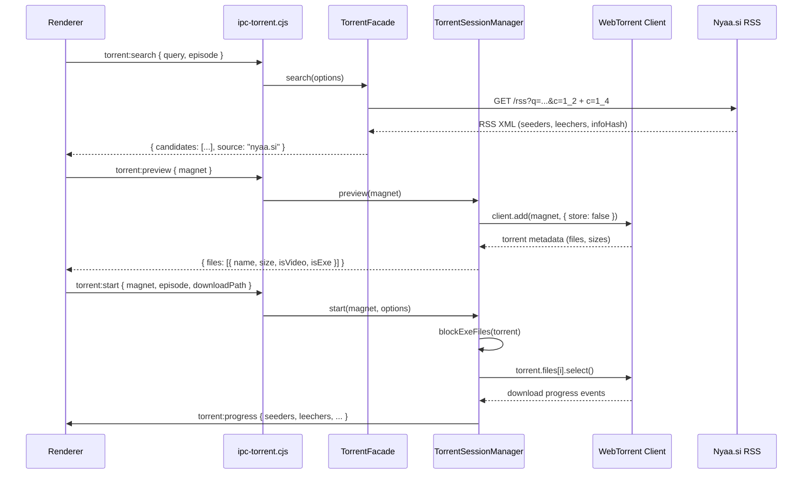
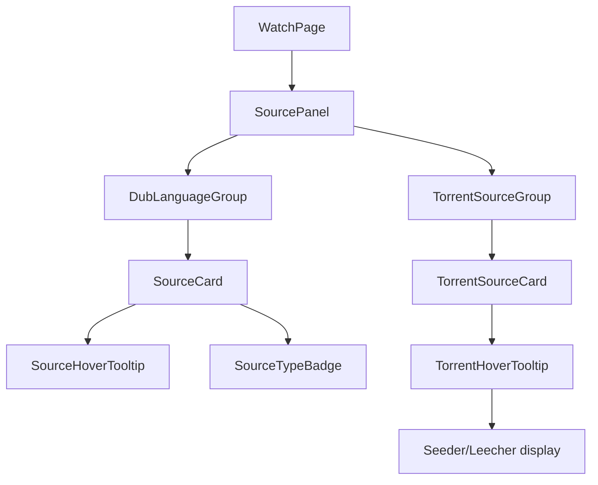
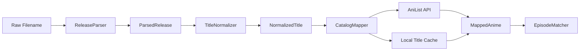
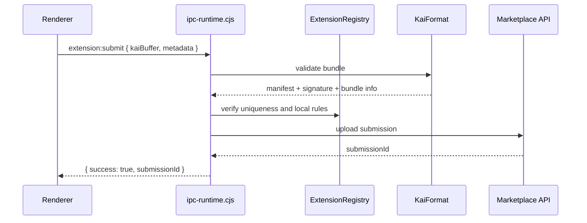

```md
# Design Document: TatakaiV5 Platform Overhaul

## Overview

This document describes the complete technical design for five interconnected feature areas of the TatakaiV5 Electron + React desktop application. The overhaul addresses:

1. A full torrent engine rewrite to improve reliability, metadata resolution, and peer-count display
2. A Watch Page source UI redesign with per-source metadata on hover and visual type differentiation
3. A more powerful anime name parser and catalog mapping system
4. End-to-end fixes to the extension platform submission, review, and download workflow
5. A unified download system that lets users choose between HLS and torrent sources, with auto-download support

All five areas share the same stack:

- Electron
- React 18
- Vite
- Zustand
- TanStack Query
- Tailwind CSS
- Radix UI

The Electron main process (Node.js, CommonJS) hosts the torrent engine, extension sandbox, and download manager. The renderer process (sandboxed Chromium) hosts all React UI. IPC is the only communication channel between them, exposed through the typed `tatakaiRuntime` and `electron` context bridges in `desktop/preload.cjs`.

---

## Architecture

### High-Level Component Map

```text
                          Renderer Process (React 18)

  WatchPage.tsx          AnimePage.tsx         ExtensionHub.tsx
  (source UI redesign)   (catalog mapping)     (submission/review/download)

  DownloadModal.tsx      NameParser hooks      ExtensionDetailPage.tsx


                   tatakaiRuntime / window.electron (contextBridge)
--------------------------------------------------------------------------------
                         IPC (ipcRenderer.invoke / ipcMain.handle)

                          Main Process (Node.js / CJS)

  ipc-torrent.cjs        ipc-runtime.cjs       ipc-download-manager.cjs

  TorrentFacade          ExtensionRegistry     DownloadQueue
  TorrentSessionManager  ExtensionWorkerPool   AutoDownloader
  CandidateDiscovery     KaiFormat             ffmpeg / HLS
  ReleaseParser          ExtensionSandbox
  EpisodeMatcher
  StreamBridge
--------------------------------------------------------------------------------
```

### IPC Channel Map

| Channel | Direction | Purpose |
|---|---|---|
| `torrent:search` | Renderer -> Main | Search Nyaa for candidates |
| `torrent:start` | Renderer -> Main | Start a torrent session from magnet or `.torrent` |
| `torrent:stop` | Renderer -> Main | Stop and clean up a session |
| `torrent:stats` | Renderer -> Main | Poll download stats |
| `torrent:stream` | Renderer -> Main | Get HTTP stream URL |
| `torrent:resolve-metadata` | Renderer -> Main | Resolve magnet metadata before download |
| `torrent:preview` | Renderer -> Main | **New:** Get file list and sizes before starting |
| `torrent:peers` | Renderer -> Main | **New:** Get real-time seeder/leecher counts |
| `torrent:progress` | Main -> Renderer | Push download progress events |
| `torrent:metadata-ready` | Main -> Renderer | **New:** Notify renderer when delayed metadata resolves |
| `extension:load` | Renderer -> Main | Load extension into registry |
| `extension:unload` | Renderer -> Main | Unload extension |
| `extension:invoke` | Renderer -> Main | Invoke extension method |
| `extension:load-kai` | Renderer -> Main | Load `.kai` bundle |
| `extension:get-source-code` | Renderer -> Main | **New:** Return `bundle.js` for transparency view |
| `extension:submit` | Renderer -> Main | **New:** Submit extension to marketplace |
| `extension:review-status` | Renderer -> Main | **New:** Poll review status |
| `download:enqueue` | Renderer -> Main | Queue HLS or torrent download |
| `download:cancel` | Renderer -> Main | Cancel active download |
| `download:list` | Renderer -> Main | List active and queued downloads |
| `auto-download:subscribe` | Renderer -> Main | Subscribe to auto-download |
| `auto-download:unsubscribe` | Renderer -> Main | Unsubscribe |
| `auto-download:list` | Renderer -> Main | List subscriptions |

---

## Area 1: Torrent Engine Overhaul

### 1.1 Current Problems

| Bug | Root Cause | Location |
|---|---|---|
| "Metadata resolution timeout" | 30s hard timeout with no retry, no DHT bootstrap, WebTorrent v2 ESM import race | `session-manager.cjs:start()` |
| `setInterval(...).unref is not a function` | WebTorrent v2 uses Node.js timer objects; Electron timer context is being polyfilled incorrectly | WebTorrent internals called from wrong context |
| No real-time seeder/leecher counts | `torrent:progress` only emits `numPeers`; no split seeder/leecher data | `session-manager.cjs:tick()` |
| No torrent preview before download | No IPC channel to inspect file list before `start()` | Missing |
| `.exe` files not blocked | No file-type filter in session start or candidate discovery | `session-manager.cjs`, `candidate-discovery.cjs` |
| `.torrent` file support missing | Only magnet links are handled in `ipc-torrent.cjs` | `ipc-torrent.cjs` |

### 1.2 Architecture: Overhauled Torrent Engine



### 1.3 Key Interfaces

```ts
interface TorrentCandidate {
  title: string;
  magnet: string;
  infoHash: string;
  seeders: number;
  leechers: number;
  downloads: number;
  size?: string;
  isTrusted: boolean;
  isRemake: boolean;
  pubDate?: string;
  parsed: ParsedRelease;
  qualityScore: number;
  displayTitle: string;
  qualityBadge: string;
  source: "nyaa.si";
}

interface TorrentPreviewResult {
  success: boolean;
  name: string;
  infoHash: string;
  totalSize: number;
  files: TorrentFileInfo[];
  hasExeFiles: boolean;
  metadataResolved?: boolean;
  error?: string;
}

interface TorrentFileInfo {
  name: string;
  path: string;
  size: number;
  isVideo: boolean;
  isExe: boolean;
  index: number;
}

interface TorrentProgressEvent {
  sessionId: string;
  progress: number;          // 0-100
  downloadSpeed: number;     // bytes/s
  uploadSpeed: number;       // bytes/s
  numPeers: number;
  seeders: number;
  leechers: number;
  ratio: number;
  done: boolean;
  eta: number | null;        // seconds
  name: string;
}

interface TorrentStartOptions {
  magnet?: string;
  torrentBuffer?: Buffer;
  episode?: number;
  season?: number;
  fileIndex?: number;
  downloadPath?: string;
}
```

### 1.4 Bug Fixes: Detailed Design

#### Fix 1: Metadata Resolution Timeout

**Problem:** `client.add(magnet, ...)` fires its callback only after metadata is fetched from peers. With no active peers or DHT bootstrap, metadata may never resolve and the 30-second timeout triggers.

**Solution:**

1. Upgrade WebTorrent to the latest stable version
2. Add explicit DHT bootstrap nodes to the WebTorrent client constructor
3. Implement a two-phase approach:
   - Try metadata resolution with a 45-second timeout
   - On timeout, return a partial result with `metadataResolved: false`
   - Continue resolving in the background
   - Emit a `torrent:metadata-ready` event when metadata becomes available
4. Add tracker announce data to `client.add()`

```js
// session-manager.cjs
async _ensureClient() {
  if (this._client) return;

  const { default: WebTorrent } = await import("webtorrent");

  this._client = new WebTorrent({
    dht: {
      bootstrap: [
        "router.bittorrent.com:6881",
        "dht.transmissionbt.com:6881",
        "router.utorrent.com:6881",
        "dht.aelitis.com:6881",
      ],
    },
    tracker: {
      announce: [],
    },
    maxConns: 55,
  });

  this._client.on("error", (err) => {
    this._logger.error("[Torrent] client error:", err.message);
  });
}
```

#### Fix 2: `setInterval(...).unref is not a function`

**Problem:** WebTorrent v2 calls `.unref()` on Node.js timer handles. In Electron's main process this should work, but the error suggests WebTorrent is being initialized in a browser-like context.

**Solution:**

- Ensure WebTorrent is only instantiated in the main process
- Add a hard guard in `_ensureClient()`
- Patch timer handles before importing WebTorrent if needed

```js
async _ensureClient() {
  if (this._client) return;

  if (typeof process === "undefined" || process.type === "renderer") {
    throw new Error("TorrentSessionManager must run in the main process");
  }

  // continue initialization...
}
```

```js
// At the top of session-manager.cjs, before import("webtorrent")
const _origSetInterval = global.setInterval;

global.setInterval = function patchedSetInterval(...args) {
  const timer = _origSetInterval(...args);
  if (timer && typeof timer.unref !== "function") {
    timer.unref = () => timer;
  }
  return timer;
};
```

#### Fix 3: Real-Time Seeder/Leecher Counts

WebTorrent exposes `torrent.numPeers`, but not separate seeder and leecher counts. Tracker scrape responses may provide this information.

**Solution:** Read scrape data from internal tracker objects, with fallback to `numPeers`.

```js
_getSeederLeecher(torrent) {
  let seeders = 0;
  let leechers = 0;

  for (const tracker of (torrent._trackers || [])) {
    if (tracker.scrapeData) {
      seeders = Math.max(seeders, tracker.scrapeData.complete || 0);
      leechers = Math.max(leechers, tracker.scrapeData.incomplete || 0);
    }
  }

  if (seeders === 0 && leechers === 0) {
    leechers = torrent.numPeers || 0;
  }

  return { seeders, leechers };
}
```

#### Fix 4: `.torrent` File Support

Add a new IPC handler and allow `torrent:start` to accept a buffer.

```js
// ipc-torrent.cjs
ipcMain.handle("torrent:start-file", async (_event, { torrentBuffer, options }) => {
  const buf = Buffer.isBuffer(torrentBuffer)
    ? torrentBuffer
    : Buffer.from(torrentBuffer);

  return facade.startFromBuffer(buf, options || {});
});
```

#### Fix 5: Block `.exe` Torrents

```js
function hasExeFiles(torrent) {
  return torrent.files.some((f) => /\.exe$/i.test(f.name));
}

if (hasExeFiles(torrent)) {
  this._client.remove(torrent, { destroyStore: true });
  return resolve({
    success: false,
    error: "BLOCKED_EXE: This torrent contains .exe files and has been blocked for security.",
    blocked: true,
  });
}
```

#### Fix 6: Torrent Preview Before Download

Add a new `torrent:preview` IPC channel that resolves metadata only, returns file info, then removes the torrent.

```js
async preview(magnet) {
  await this._ensureClient();

  return new Promise((resolve) => {
    const timeout = setTimeout(() => {
      resolve({ success: false, error: "preview_timeout" });
    }, 20000);

    this._client.add(magnet, { store: false }, (torrent) => {
      clearTimeout(timeout);

      const files = torrent.files.map((f, i) => ({
        name: f.name,
        path: f.path,
        size: f.length,
        isVideo: /\.(mkv|mp4|avi|m4v|ts|mov)$/i.test(f.name),
        isExe: /\.exe$/i.test(f.name),
        index: i,
      }));

      const hasExe = files.some((f) => f.isExe);

      this._client.remove(torrent, { destroyStore: true });

      resolve({
        success: true,
        name: torrent.name,
        infoHash: torrent.infoHash,
        totalSize: torrent.length,
        files,
        hasExeFiles: hasExe,
        metadataResolved: true,
      });
    });
  });
}
```

---

## Area 2: Watch Page Source UI Redesign

### 2.1 Current Problems

| Issue | Location |
|---|---|
| Sources are not categorized by dub language | `WatchPage.tsx` flat server list |
| No hover metadata | `WatchPage.tsx` source buttons have no tooltip |
| No visual differentiation by source type (`HLS`, `Embed`, `Torrent`) | `WatchPage.tsx` all buttons look identical |
| Torrent and anime info alignment is broken | `WatchPage.tsx` layout |
| "Continue Watch" shows placeholder image | `updateLocalContinueWatching()` poster not persisted |

### 2.2 Architecture: Source UI



### 2.3 Source Categorization Model

```ts
type SourceType = "hls" | "embed" | "torrent";

interface CategorizedSource {
  type: SourceType;
  url: string;
  quality: string;
  dubLanguage: string;
  dubLanguageCode: string;
  sourceName: string;
  groupName?: string;
  seeders?: number;
  leechers?: number;
  providerKey: string;
  providerName: string;
  isEmbed: boolean;
  isM3U8: boolean;
  headers?: Record<string, string>;
}

interface DubLanguageGroup {
  language: string;
  languageCode: string;
  sources: CategorizedSource[];
}
```

### 2.4 Source Panel Component Design

```ts
interface SourcePanelProps {
  sources: CategorizedSource[];
  selectedSourceKey: string | null;
  onSelectSource: (source: CategorizedSource) => void;
}
```

Visual differentiation rules:

- **HLS sources**: `bg-muted/50 text-muted-foreground`, badge `"HLS"`
- **Embed sources**: `bg-primary/20 text-primary`, badge `"Embed"`
- **Torrent sources**: `bg-green-500/20 text-green-400`, badge `"Torrent"`

#### Source Type Badge

```ts
const SOURCE_TYPE_STYLES: Record<SourceType, { bg: string; text: string; label: string }> = {
  hls: {
    bg: "bg-muted/60",
    text: "text-muted-foreground",
    label: "HLS",
  },
  embed: {
    bg: "bg-primary/20",
    text: "text-primary",
    label: "Embed",
  },
  torrent: {
    bg: "bg-green-500/20",
    text: "text-green-400",
    label: "Torrent",
  },
};
```

#### Hover Tooltip Content

```ts
interface SourceTooltipData {
  dubLanguage: string;
  sourceType: SourceType;
  quality: string;
  groupName?: string;
  seeders?: number;
  leechers?: number;
  providerName: string;
}
```

The tooltip should render on `onMouseEnter` using Radix UI Tooltip with a 200ms delay. For torrent sources, seeder and leecher values are fetched from the live `torrent:peers` IPC channel if a session is active, or from candidate metadata if the torrent has not started yet.

### 2.5 Dub Language Grouping Algorithm

```ts
function groupSourcesByDubLanguage(sources: CategorizedSource[]): DubLanguageGroup[] {
  const groups = new Map<string, CategorizedSource[]>();

  for (const source of sources) {
    const key = source.dubLanguageCode || "unknown";
    if (!groups.has(key)) groups.set(key, []);
    groups.get(key)!.push(source);
  }

  const PRIORITY: Record<string, number> = {
    ja: 0,
    en: 1,
  };

  return [...groups.entries()]
    .map(([code, srcs]) => ({
      language: srcs[0].dubLanguage,
      languageCode: code,
      sources: srcs,
    }))
    .sort((a, b) => {
      const pa = PRIORITY[a.languageCode] ?? 99;
      const pb = PRIORITY[b.languageCode] ?? 99;
      if (pa !== pb) return pa - pb;
      return a.language.localeCompare(b.language);
    });
}
```

### 2.6 "Continue Watch" Poster Fix

The bug is in `updateLocalContinueWatching()` in `src/lib/localStorage.ts`. The poster URL is not being passed consistently, or it is being overwritten with a placeholder.

**Fix:** Ensure `animePoster` is always passed from `WatchPage.tsx`, and never overwrite a valid poster with an empty value.

```ts
export function updateLocalContinueWatching(entry: ContinueWatchingEntry) {
  const existing = getLocalContinueWatching();
  const idx = existing.findIndex((e) => e.episodeId === entry.episodeId);

  const merged: ContinueWatchingEntry =
    idx >= 0
      ? {
          ...existing[idx],
          ...entry,
          animePoster: entry.animePoster || existing[idx].animePoster || "",
        }
      : entry;

  // continue update logic...
}
```

---

## Area 3: Name Parser and Anime Catalog Mapping

### 3.1 Current State

The existing `release-parser.cjs` is a solid Anitomy-style regex parser. It already handles:

- Release groups
- Resolution
- Codec
- Audio
- Source
- Bit depth
- Subtitle format
- Episode numbers (`SxEx`, dash episode, range, keyword, decimal specials)
- Season extraction
- Batch detection
- Trusted group list

**Gaps identified:**

1. Alternate titles are not handled well, e.g. `Shingeki no Kyojin` vs `Attack on Titan`
2. Season number mapping to AniList season entries is not implemented
3. Special characters in titles cause search mismatches, e.g. `Re:Zero`, `86 - Eighty Six`
4. Episode ranges in batch torrents are not mapped to individual episodes
5. `buildSearchTitle()` strips too aggressively and removes meaningful numbers

### 3.2 Enhanced Parser Architecture



### 3.3 Title Normalizer

```ts
interface NormalizationOptions {
  stripArticles?: boolean;
  normalizeSpecialChars?: boolean;
  expandAbbreviations?: boolean;
  removeYearSuffix?: boolean;
}

export function normalizeTitle(title: string, opts: NormalizationOptions = {}): string {
  let t = title.trim();

  if (opts.normalizeSpecialChars) {
    t = t
      .replace(/[：:]/g, "")
      .replace(/[！!]/g, "")
      .replace(/[？?]/g, "")
      .replace(/[_\-]+/g, " ")
      .replace(/[～~]/g, " ")
      .normalize("NFKC");
  }

  if (opts.stripArticles) {
    t = t.replace(/^(The|A|An)\s+/i, "");
  }

  if (opts.removeYearSuffix) {
    t = t.replace(/\s*\(\d{4}\)\s*$/, "");
  }

  t = t.replace(/\s+/g, " ").trim();

  return t;
}

export function buildSearchVariants(title: string): string[] {
  const variants = new Set<string>();

  variants.add(title);
  variants.add(normalizeTitle(title, { stripArticles: true }));
  variants.add(normalizeTitle(title, { normalizeSpecialChars: true }));
  variants.add(
    normalizeTitle(title, {
      stripArticles: true,
      normalizeSpecialChars: true,
      removeYearSuffix: true,
    })
  );

  const withoutSeason = title.replace(/\s+(Season|Part|Cour)\s+\d+\s*$/i, "").trim();
  if (withoutSeason !== title) variants.add(withoutSeason);

  const withoutOrdinal = title.replace(/\s+\d+(st|nd|rd|th)\s+Season\s*$/i, "").trim();
  if (withoutOrdinal !== title) variants.add(withoutOrdinal);

  return [...variants].filter(Boolean);
}
```

### 3.4 Catalog Mapper

```ts
interface CatalogMappingResult {
  anilistId: number | null;
  malId: number | null;
  tatakaiId: string | null;
  matchedTitle: string;
  confidence: number;
  seasonOffset: number;
  method: "exact" | "fuzzy" | "alternate" | "cache";
}

export async function mapParsedReleaseToAnime(
  parsed: ParsedRelease,
  hints?: { anilistId?: number; malId?: number }
): Promise<CatalogMappingResult> {
  if (hints?.anilistId) {
    return {
      anilistId: hints.anilistId,
      malId: hints.malId ?? null,
      tatakaiId: null,
      matchedTitle: parsed.title ?? "",
      confidence: 100,
      seasonOffset: 0,
      method: "exact",
    };
  }

  const cached = await titleCache.lookup(parsed.searchTitle ?? parsed.title ?? "");
  if (cached) return { ...cached, method: "cache" };

  const variants = buildSearchVariants(parsed.title ?? "");

  for (const variant of variants) {
    const result = await searchAniList(variant, parsed.season);
    if (result && result.confidence >= 80) {
      await titleCache.store(parsed.searchTitle ?? "", result);
      return {
        ...result,
        method: result.confidence === 100 ? "exact" : "fuzzy",
      };
    }
  }

  const altResult = await searchAniListBySynonyms(variants);
  if (altResult) {
    return {
      ...altResult,
      method: "alternate",
    };
  }

  return {
    anilistId: null,
    malId: null,
    tatakaiId: null,
    matchedTitle: parsed.title ?? "",
    confidence: 0,
    seasonOffset: 0,
    method: "fuzzy",
  };
}
```

### 3.5 Season Number to AniList Entry Mapping

AniList models multi-season anime as separate entries. If the parser extracts `season: 2` from a filename such as `[SubsPlease] Anime S02E05`, the mapping logic must find the correct AniList entry for season 2.

```ts
async function resolveSeasonEntry(
  baseAnilistId: number,
  targetSeason: number
): Promise<number | null> {
  if (targetSeason <= 1) return baseAnilistId;

  const relations = await fetchAniListRelations(baseAnilistId);

  const sequels = relations
    .filter((r) => r.relationType === "SEQUEL")
    .sort(
      (a, b) => (a.startDate?.year ?? 9999) - (b.startDate?.year ?? 9999)
    );

  const idx = targetSeason - 2;
  return sequels[idx]?.id ?? null;
}
```

### 3.6 Edge Case Handling

| Edge Case | Handling |
|---|---|
| `Re:Zero` | `normalizeSpecialChars` strips `:` for search while keeping original for display |
| `86 - Eighty Six` | Try both `86` and `Eighty Six` variants |
| `Sword Art Online: Alicization` | Strip colon for search, preserve for display |
| `Overlord IV` | Interpret Roman numeral `IV` as season 4 and use season hint |
| `Shingeki no Kyojin` vs `Attack on Titan` | Use AniList synonym search and local cache |
| Episode `18.5` | Mark as `isSpecial: true`, not a regular episode |
| Batch torrent with range | Expand episode range into individual episode mappings |

---

## Area 4: Extension Platform Submission, Review, and Download Workflow

### 4.1 Current Problems

| Issue | Impact |
|---|---|
| Extension submission is incomplete | Users cannot publish extensions reliably |
| Review status is not visible | Authors cannot track moderation progress |
| Download/install flow is inconsistent | Marketplace UX is confusing |
| Source transparency is limited | Users cannot inspect extension bundle code |
| Registry state can drift from installed state | UI may show incorrect install status |

### 4.2 Goals

- Allow creators to submit `.kai` bundles directly from the app
- Track submission review status
- Support marketplace browsing, install, update, and uninstall
- Expose extension source code for transparency
- Keep installed state synchronized with registry and local storage

### 4.3 Core Components

```text
ExtensionHub.tsx
  ├─ MarketplaceList
  ├─ SubmissionDialog
  ├─ ReviewStatusPanel
  └─ InstalledExtensionsPanel

ExtensionDetailPage.tsx
  ├─ ExtensionMetadataCard
  ├─ SourceCodeViewer
  ├─ InstallButton
  └─ VersionHistory
```

### 4.4 IPC and Main-Process Responsibilities

#### New Channels

- `extension:submit`
- `extension:review-status`
- `extension:get-source-code`

#### Main Process Modules

- `ExtensionRegistry`
- `ExtensionWorkerPool`
- `ExtensionSandbox`
- `KaiFormat`

### 4.5 Submission Flow



### 4.6 Source Code Transparency

The `extension:get-source-code` channel returns the bundled `bundle.js` contents for a selected extension. This enables:

- User transparency
- Manual review
- Debugging of extension behavior

```js
ipcMain.handle("extension:get-source-code", async (_event, { extensionId }) => {
  return extensionRegistry.getBundleSource(extensionId);
});
```

### 4.7 Review Status Polling

The renderer polls `extension:review-status` periodically while a submission is in a non-terminal state.

Review states:

- `pending`
- `in_review`
- `approved`
- `rejected`
- `changes_requested`

```ts
interface ExtensionReviewStatus {
  submissionId: string;
  status: "pending" | "in_review" | "approved" | "rejected" | "changes_requested";
  reviewerNotes?: string;
  updatedAt: string;
}
```

### 4.8 Download and Install Flow

1. User selects an extension from the marketplace
2. Renderer fetches extension metadata
3. User clicks install
4. Main process downloads the `.kai` bundle
5. `KaiFormat` validates signature and manifest
6. `ExtensionRegistry` installs and loads the extension
7. Renderer refreshes installed state

### 4.9 Failure Handling

| Failure | Response |
|---|---|
| Invalid `.kai` signature | Block install and show security error |
| Missing manifest fields | Reject submission or install |
| Version conflict | Offer update or sidegrade warning |
| Sandbox load failure | Mark extension as failed and keep disabled |
| Review API unavailable | Retry with backoff and show status banner |

---

## Area 5: Unified Download System

### 5.1 Goals

Provide a single download flow for:

- HLS downloads
- Torrent downloads
- Auto-download subscriptions

Users should be able to choose a source type explicitly, or allow the app to decide based on preferences and availability.

### 5.2 Core Components

```text
DownloadModal.tsx
  ├─ SourceSelector
  ├─ QualitySelector
  ├─ OutputPathPicker
  └─ ConfirmDownloadButton

Main Process
  ├─ DownloadQueue
  ├─ AutoDownloader
  ├─ TorrentSessionManager
  └─ ffmpeg / HLS pipeline
```

### 5.3 Unified Download Model

```ts
type DownloadKind = "hls" | "torrent";

interface DownloadRequest {
  id: string;
  animeId: string;
  episode: number;
  title: string;
  kind: DownloadKind;
  sourceUrl?: string;
  magnet?: string;
  torrentBuffer?: Buffer;
  outputPath: string;
  quality?: string;
  headers?: Record<string, string>;
  fileIndex?: number;
}

interface DownloadJob {
  id: string;
  status: "queued" | "running" | "completed" | "failed" | "cancelled";
  progress: number;
  speed?: number;
  eta?: number | null;
  kind: DownloadKind;
  title: string;
  episode: number;
  outputPath: string;
  error?: string;
}
```

### 5.4 Download Queue Behavior

- Queue both HLS and torrent jobs in one unified list
- Run configurable concurrent downloads
- Preserve state across app restarts if possible
- Support cancel, retry, and removal

### 5.5 HLS Download Pipeline

1. Fetch playlist
2. Resolve variant playlist if needed
3. Download segments
4. Merge with `ffmpeg`
5. Write final media file
6. Verify output and mark complete

### 5.6 Torrent Download Pipeline

1. Resolve metadata if magnet-based
2. Preview files if needed
3. Block `.exe`-containing torrents
4. Select target file or episode
5. Start torrent session
6. Track progress and completion
7. Finalize and register output

### 5.7 Auto-Download

Users can subscribe to automatic downloads for a show, season, or provider preference.

```ts
interface AutoDownloadSubscription {
  id: string;
  animeId: string;
  preferredType: "hls" | "torrent" | "any";
  preferredLanguage?: string;
  preferredQuality?: string;
  downloadPath: string;
  enabled: boolean;
}
```

### 5.8 Auto-Download Matching Logic

When a new episode becomes available:

1. Find all active subscriptions matching the anime
2. Resolve available sources
3. Filter by language and quality preferences
4. Prefer source type based on subscription
5. Enqueue the best matching download job

### 5.9 UI Behavior

In `DownloadModal.tsx`, the user can:

- Choose between HLS and torrent if both are available
- Preview torrent files before confirming
- Pick quality and dub language
- Select output path
- Enable auto-download for future episodes

---

## Security Considerations

### Torrent Security

- Block `.exe` files by default
- Do not auto-execute downloaded files
- Sanitize preview metadata before rendering
- Restrict torrent engine to the main process only

### Extension Security

- Validate `.kai` bundle signatures
- Run extensions inside a sandbox
- Expose only approved APIs to extensions
- Provide source-code transparency where possible

### IPC Security

- Validate all IPC payloads
- Use typed bridges only
- Do not expose unrestricted Node.js APIs to the renderer

---

## Performance Considerations

- Cache AniList mapping results locally
- Debounce repeated source grouping and sorting
- Reuse a single WebTorrent client where possible
- Avoid keeping metadata-only preview sessions alive longer than necessary
- Limit concurrent HLS segment downloads to avoid network saturation

---

## Testing Plan

### Torrent Engine

- Magnet metadata resolution success/failure
- `.torrent` file start flow
- Preview flow
- Seeder/leecher reporting
- `.exe` blocking
- Session cleanup after stop/cancel

### Watch Page UI

- Source grouping by dub language
- Tooltip rendering
- Badge styling by source type
- Torrent metadata display
- Continue Watching poster persistence

### Parser and Catalog Mapping

- Special-character normalization
- Alternate title mapping
- Season-to-entry resolution
- Batch range expansion
- Synonym cache behavior

### Extension Platform

- Submission validation
- Review status polling
- Install/uninstall flow
- Source-code retrieval
- Registry synchronization

### Unified Downloads

- HLS queueing and completion
- Torrent queueing and completion
- Cancel/retry behavior
- Auto-download subscription matching
- Mixed queue concurrency

---

## Rollout Plan

### Phase 1
- Torrent engine fixes
- `.torrent` support
- Preview support
- `.exe` blocking

### Phase 2
- Watch Page source UI redesign
- Continue Watching poster fix

### Phase 3
- Name parser normalization and catalog mapping improvements

### Phase 4
- Extension platform submission and review workflow

### Phase 5
- Unified download system and auto-download subscriptions

---

## Summary

This overhaul modernizes TatakaiV5 across five major areas:

- A more reliable and secure torrent engine
- A clearer and more informative Watch Page source experience
- Smarter anime title parsing and AniList mapping
- A complete extension marketplace workflow
- A unified download system for HLS and torrents

The design keeps the Electron main process responsible for privileged operations, keeps the renderer focused on UI, and uses typed IPC as the strict boundary between them.
```