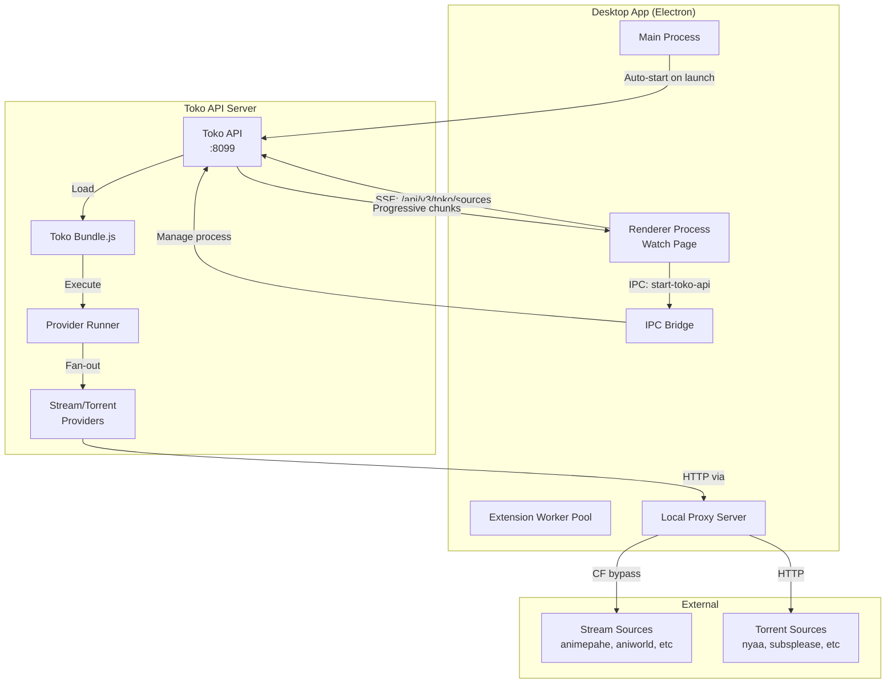
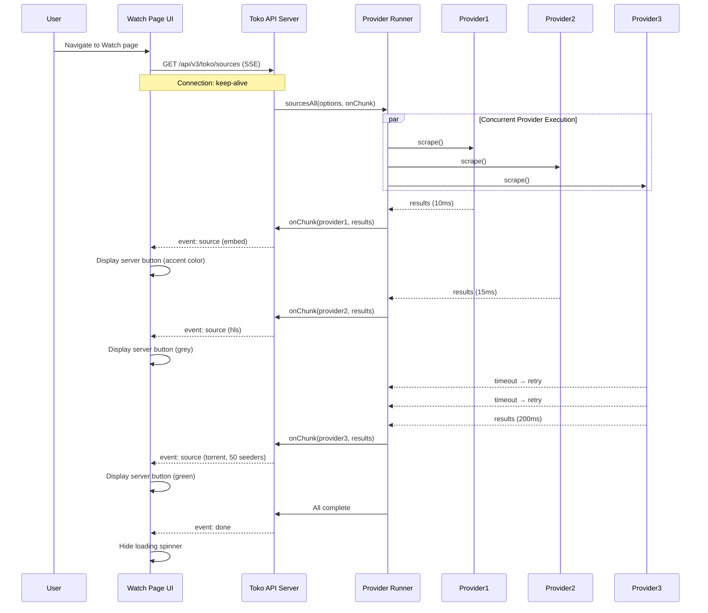

# Design Document: Toko Streaming Extension Service

## Overview

The Toko Streaming Extension Service enhances the Watch page experience by implementing progressive provider scraping with real-time result streaming, enhanced UI with color-coded server buttons, and automatic Toko API server initialization. The service provides immediate feedback by displaying stream sources as they become available rather than waiting for all providers to complete, significantly improving perceived performance and user experience.

The system integrates deeply with the existing desktop extension worker pool, Toko API server, and local proxy infrastructure. Key innovations include Server-Sent Events (SSE) for progressive results, intelligent color coding based on source type and availability, comprehensive hover tooltips, and language-based categorization.

## Architecture

### High-Level System Diagram



### Sequence Diagram: Progressive Source Scraping



## Components and Interfaces

### Component 1: Toko API Auto-Start Manager

**Purpose**: Automatically start the Toko API server when the desktop app launches, ensuring stream sources are available immediately when users navigate to the Watch page.

**Interface**:
```typescript
interface TokoAPIManager {
  /**
   * Start the Toko API server on app launch
   * @returns Promise resolving to server status
   */
  startTokoAPI(): Promise<TokoAPIStatus>;
  
  /**
   * Check if Toko API is running and healthy
   */
  checkHealth(): Promise<boolean>;
  
  /**
   * Restart Toko API server if it crashes
   */
  restartIfNeeded(): Promise<void>;
  
  /**
   * Stop Toko API server on app shutdown
   */
  stopTokoAPI(): Promise<void>;
}

interface TokoAPIStatus {
  running: boolean;
  port: number;
  baseUrl: string;
  pid?: number;
  error?: string;
}
```

**Responsibilities**:
- Spawn Toko API server child process on desktop app launch
- Monitor server health via `/api/v3/health` endpoint
- Auto-restart on crash with exponential backoff
- Gracefully shutdown server when app closes
- Emit IPC events for server state changes

**Integration Points**:
- Called from `desktop/main.cjs` during app `ready` event
- Uses `child_process.spawn()` to launch Node.js process
- Coordinates with IPC runtime handlers

---

### Component 2: Progressive Source Resolver (Frontend)

**Purpose**: Consume Server-Sent Events from Toko API and progressively display source results as they arrive, providing immediate user feedback.

**Interface**:
```typescript
interface ProgressiveSourceResolver {
  /**
   * Start progressive source scraping with SSE
   * @param options Source request parameters
   * @param callbacks Event handlers for progressive updates
   * @returns Promise resolving when all sources complete
   */
  resolveSourcesProgressive(
    options: SourceResolveOptions,
    callbacks: ProgressiveCallbacks
  ): Promise<SourceResolveResult>;
  
  /**
   * Cancel ongoing source resolution
   */
  cancel(): void;
}

interface SourceResolveOptions {
  anilistId: number;
  episode: number;
  titles: string[];
  resolution: string;
  preferredLanguages?: string[];
}

interface ProgressiveCallbacks {
  onSource: (source: EnhancedSource) => void;
  onProviderStatus: (status: ProviderDiagnostic) => void;
  onComplete: (summary: CompleteSummary) => void;
  onError: (error: Error) => void;
}

interface EnhancedSource {
  // Core source data
  url: string;
  quality: string;
  providerName: string;
  providerKey: string;
  server: string;
  
  // Type classification
  type: 'embed' | 'hls' | 'mp4' | 'torrent';
  isM3U8: boolean;
  isEmbed: boolean;
  isTorrent: boolean;
  
  // Language metadata
  audioLanguage: string;
  language: string;
  languageLabel: string;  // e.g. "🇬🇧 English Dub"
  isDub: boolean;
  
  // Torrent-specific metadata
  seeders?: number;
  leechers?: number;
  peers?: number;
  torrentTitle?: string;
  fileSize?: string;
  fileFormat?: string;
  
  // Display metadata
  friendlyName: string;    // e.g. "Naruto", "Miki"
  colorCategory: 'accent' | 'grey' | 'green' | 'red';
  tooltipData: TooltipData;
}

interface TooltipData {
  sourceType: string;      // "Embed", "HLS", "MP4", "Torrent"
  quality: string;
  audioLanguage: string;
  torrentTitle?: string;
  fileFormat?: string;
  providerName: string;
  providerKey: string;
  serverName: string;
  language: string;
  languageLabel: string;
  seeders?: number;
  leechers?: number;
}

interface CompleteSummary {
  totalCount: number;
  byLanguage: Record<string, EnhancedSource[]>;
  byType: Record<string, EnhancedSource[]>;
  cached: boolean;
  fetchedAt: string;
}
```

**Responsibilities**:
- Establish EventSource connection to Toko API SSE endpoint
- Parse incoming `source`, `provider_status`, and `done` events
- Enrich source data with UI metadata (color, friendly name, tooltip)
- Emit callbacks for progressive UI updates
- Handle connection errors and implement retry logic
- Close EventSource on completion or cancellation

---

### Component 3: Enhanced Server Button Renderer

**Purpose**: Display server buttons with color coding, friendly names, and hover tooltips based on source type and availability.

**Interface**:
```typescript
interface ServerButtonRenderer {
  /**
   * Render a server button for a source
   */
  renderButton(source: EnhancedSource): React.ReactElement;
  
  /**
   * Determine color category for a source
   */
  getColorCategory(source: EnhancedSource): ColorCategory;
  
  /**
   * Generate friendly server name
   */
  getFriendlyName(source: EnhancedSource): string;
  
  /**
   * Build tooltip content
   */
  buildTooltip(source: EnhancedSource): TooltipContent;
}

type ColorCategory = 'accent' | 'grey' | 'green' | 'red';

interface TooltipContent {
  title: string;
  rows: TooltipRow[];
}

interface TooltipRow {
  label: string;
  value: string;
  icon?: string;
}
```

**Color Coding Rules**:
- **Accent color** (primary brand color): Embed sources (`type === 'embed'`)
- **Grey** (default): HLS/MP4 sources (`type === 'hls' || type === 'mp4'`)
- **Green**: Torrent sources with seeders > 0 (`type === 'torrent' && seeders > 0`)
- **Red**: Torrent sources with 0 seeders (`type === 'torrent' && seeders === 0`)

**Friendly Name Mapping**:
- Remove technical prefixes like provider keys
- Extract clean names from `server` field
- Examples: `toonstream-gdmirrorbot` → `Miku`, `aniworld-vidoza` → `Topo`
- Show provider name only in hover tooltip

**Responsibilities**:
- Apply Tailwind CSS classes for color categories
- Render button with friendly name as primary text
- Attach hover tooltip with comprehensive metadata
- Support keyboard navigation and accessibility

---

### Component 4: Language-Based Source Categorizer

**Purpose**: Group and categorize sources by language to enable language tabs and improve discoverability.

**Interface**:
```typescript
interface SourceCategorizer {
  /**
   * Categorize sources by language
   */
  categorizeByLanguage(sources: EnhancedSource[]): LanguageCategory[];
  
  /**
   * Categorize sources by type
   */
  categorizeByType(sources: EnhancedSource[]): TypeCategory[];
  
  /**
   * Get language priority order based on user preferences
   */
  getLanguagePriority(
    available: string[],
    preferred: string[]
  ): string[];
}

interface LanguageCategory {
  code: string;           // BCP-47 code e.g. "en", "ja", "ar"
  label: string;          // Human-readable e.g. "English"
  flag: string;           // Emoji flag e.g. "🇬🇧" // you will use icons not emoji
  isDub: boolean;
  sources: EnhancedSource[];
  count: number;
}

interface TypeCategory {
  type: 'embed' | 'hls' | 'mp4' | 'torrent';
  label: string;
  sources: EnhancedSource[];
  count: number;
}
```

**Categorization Logic**:
```
FOR each source IN sources:
  language_key = source.audioLanguage OR 'und'
  IF NOT language_categories[language_key]:
    CREATE new LanguageCategory(
      code = language_key,
      label = source.language,
      flag = LANG_FLAG_MAP[language_key],
      isDub = source.isDub
    )
  END IF
  APPEND source TO language_categories[language_key].sources
END FOR

SORT language_categories BY user preference order
RETURN language_categories
```

**Responsibilities**:
- Build language-keyed map of sources
- Generate language tabs with flags and labels
- Sort languages by user preference (preferred first)
- Provide type-based filtering within each language
- Handle unknown/undefined languages gracefully

---

### Component 5: Toko API SSE Handler (Backend)

**Purpose**: Stream source results progressively to clients using Server-Sent Events, enabling real-time UI updates as providers complete.

**Interface** (Express route):
```javascript
/**
 * GET /api/v3/toko/sources
 * Query params:
 *   - anilistId: number
 *   - episode: number
 *   - titles[]: string[]
 *   - resolution: string
 *   - preferredLanguages: string (comma-separated)
 *   - stream: "0" | "1" (0 = JSON, 1 = SSE)
 */
app.get('/api/v3/toko/sources', async (req, res) => {
  // Implementation in server.js
});
```

**SSE Event Format**:
```
event: source
data: {"url":"...","quality":"1080p","type":"embed",...}

event: provider_status
data: {"provider":"animepahe","status":"ok","durationMs":10,"resultCount":3}

event: done
data: {"totalCount":15,"cached":false}
```

**Responsibilities**:
- Establish SSE connection with proper headers
- Invoke `toko.sourcesAll(opts, onChunk)` for progressive results
- Emit `source` event for each result as it arrives
- Emit `provider_status` event after each provider completes
- Emit `done` event when all providers finish
- Handle cache hits (emit all sources immediately)
- Set appropriate timeouts and error handling

---

## Data Models

### Model 1: EnhancedSource

```typescript
interface EnhancedSource {
  // Core source data (from Toko bundle)
  source: string;
  url: string;
  quality: string;
  headers: Record<string, string>;
  subtitles: SubtitleTrack[];
  
  // Type classification
  type: 'embed' | 'hls' | 'mp4' | 'torrent';
  sourceType?: string;
  isM3U8: boolean;
  isEmbed: boolean;
  isTorrent: boolean;
  
  // Provider metadata
  providerName: string;
  providerKey: string;
  server: string;
  
  // Language metadata
  audioLanguage: string;    // BCP-47 code e.g. "en", "ja", "ar"
  language: string;         // Human-readable e.g. "English"
  languageLabel: string;    // Full label e.g. "🇬🇧 English Dub"
  isDub: boolean;
  
  // Torrent-specific metadata (only present when isTorrent === true)
  seeders?: number;
  leechers?: number;
  peers?: number;           // seeders + leechers
  torrentTitle?: string;
  fileSize?: string;        // e.g. "1.4 GB"
  fileFormat?: string;      // e.g. "mkv", "mp4"
  magnetLink?: string;
  
  // UI-specific enrichments (added by frontend)
  friendlyName: string;     // e.g. "Naruto", "GDMirror", "Vidoza"
  colorCategory: 'accent' | 'grey' | 'green' | 'red';
  tooltipData: TooltipData;
}
```

**Validation Rules**:
- `url` must be non-empty string
- `type` must be one of: embed, hls, mp4, torrent
- `audioLanguage` must be valid BCP-47 code or "und"
- `seeders`, `leechers`, `peers` must be non-negative integers when present
- `isDub` must be boolean

---

### Model 2: ProviderDiagnostic

```typescript
interface ProviderDiagnostic {
  provider: string;
  status: 'ok' | 'error' | 'timeout' | 'empty';
  durationMs: number;
  resultCount: number;
  attempts: number;
  error?: string;
}
```

**Validation Rules**:
- `provider` must be non-empty string
- `status` must be one of: ok, error, timeout, empty
- `durationMs` must be non-negative integer
- `resultCount` must be non-negative integer
- `attempts` must be positive integer

---

### Model 3: TokoAPIStatus

```typescript
interface TokoAPIStatus {
  running: boolean;
  port: number;
  baseUrl: string;
  pid?: number;
  uptime?: number;        // seconds since start
  lastHealthCheck?: number;  // timestamp of last successful health check
  error?: string;
}
```

**Validation Rules**:
- `port` must be integer in range 1024-65535
- `baseUrl` must be valid HTTP URL
- `pid` must be positive integer when running
- `uptime` must be non-negative number

---

## Algorithmic Pseudocode

### Main Processing Algorithm: Progressive Source Resolution

```pascal
ALGORITHM resolveSourcesProgressive(options)
INPUT: options of type SourceResolveOptions
OUTPUT: CompleteSummary with all sources

BEGIN
  ASSERT options.anilistId > 0
  ASSERT options.episode >= 1
  ASSERT options.titles.length > 0
  
  // Step 1: Check if Toko API is running
  apiStatus ← checkTokoAPIStatus()
  IF NOT apiStatus.running THEN
    THROW Error("Toko API not running. Please start the server.")
  END IF
  
  // Step 2: Build SSE request URL
  url ← buildTokoSourcesURL(options)
  eventSource ← new EventSource(url)
  
  sources ← []
  providerStatuses ← []
  
  // Step 3: Set up event handlers
  eventSource.on("source", (event) → BEGIN
    rawSource ← parseJSON(event.data)
    enhancedSource ← enrichSourceData(rawSource)
    sources.add(enhancedSource)
    callbacks.onSource(enhancedSource)
  END)
  
  eventSource.on("provider_status", (event) → BEGIN
    diagnostic ← parseJSON(event.data)
    providerStatuses.add(diagnostic)
    callbacks.onProviderStatus(diagnostic)
  END)
  
  eventSource.on("done", (event) → BEGIN
    summary ← parseJSON(event.data)
    eventSource.close()
    
    // Step 4: Categorize all sources
    byLanguage ← categorizeByLanguage(sources)
    byType ← categorizeByType(sources)
    
    result ← CompleteSummary(
      totalCount = summary.totalCount,
      byLanguage = byLanguage,
      byType = byType,
      cached = summary.cached,
      fetchedAt = summary.fetchedAt
    )
    
    callbacks.onComplete(result)
  END)
  
  eventSource.on("error", (error) → BEGIN
    eventSource.close()
    callbacks.onError(error)
  END)
  
  RETURN AWAIT eventSource completion
END
```

**Preconditions:**
- Toko API server is running and healthy
- `options.anilistId` is a valid positive integer
- `options.episode` is a valid positive integer
- `options.titles` is a non-empty array of strings
- EventSource is supported by the browser/environment

**Postconditions:**
- All available sources have been returned via `onSource` callback
- Provider diagnostics have been returned via `onProviderStatus` callback
- Complete summary has been returned via `onComplete` callback
- EventSource connection is closed

**Loop Invariants:**
- All sources emitted via `onSource` are valid EnhancedSource objects
- All provider statuses emitted via `onProviderStatus` are valid ProviderDiagnostic objects
- EventSource remains open until "done" or "error" event

---

### Source Enrichment Algorithm

```pascal
ALGORITHM enrichSourceData(rawSource)
INPUT: rawSource from Toko API
OUTPUT: enhancedSource with UI metadata

BEGIN
  // Step 1: Determine source type
  type ← resolveSourceType(rawSource)
  
  // Step 2: Determine color category
  IF type = "embed" THEN
    colorCategory ← "accent"
  ELSE IF type = "hls" OR type = "mp4" THEN
    colorCategory ← "grey"
  ELSE IF type = "torrent" AND rawSource.seeders > 0 THEN
    colorCategory ← "green"
  ELSE IF type = "torrent" AND rawSource.seeders = 0 THEN
    colorCategory ← "red"
  ELSE
    colorCategory ← "grey"
  END IF
  
  // Step 3: Generate friendly name
  friendlyName ← extractFriendlyName(rawSource.server, rawSource.providerName)
  
  // Step 4: Build tooltip data
  tooltipData ← TooltipData(
    sourceType = TYPE_LABELS[type],
    quality = rawSource.quality,
    audioLanguage = rawSource.language,
    torrentTitle = rawSource.torrentTitle,
    fileFormat = rawSource.fileFormat,
    providerName = rawSource.providerName,
    providerKey = rawSource.providerKey,
    serverName = rawSource.server,
    language = rawSource.language,
    languageLabel = rawSource.languageLabel,
    seeders = rawSource.seeders,
    leechers = rawSource.leechers
  )
  
  // Step 5: Combine all metadata
  enhancedSource ← EnhancedSource(
    ...rawSource,
    type = type,
    colorCategory = colorCategory,
    friendlyName = friendlyName,
    tooltipData = tooltipData
  )
  
  RETURN enhancedSource
END
```

**Preconditions:**
- `rawSource` is a valid SourceResult object from Toko API
- `rawSource.url` is non-empty string
- `rawSource.server` is non-empty string

**Postconditions:**
- Result is a valid EnhancedSource object
- `colorCategory` is one of: accent, grey, green, red
- `friendlyName` is non-empty string
- `tooltipData` contains all required tooltip fields

---

### Language Categorization Algorithm

```pascal
ALGORITHM categorizeByLanguage(sources)
INPUT: sources array of EnhancedSource
OUTPUT: categories array of LanguageCategory

BEGIN
  languageMap ← EmptyMap()
  
  // Step 1: Group sources by language code
  FOR EACH source IN sources DO
    languageCode ← source.audioLanguage OR "und"
    
    IF NOT languageMap.has(languageCode) THEN
      languageMap[languageCode] ← LanguageCategory(
        code = languageCode,
        label = source.language OR LANG_LABEL_MAP[languageCode],
        flag = LANG_FLAG_MAP[languageCode] OR "🌐",
        isDub = source.isDub,
        sources = [],
        count = 0
      )
    END IF
    
    languageMap[languageCode].sources.add(source)
    languageMap[languageCode].count = languageMap[languageCode].count + 1
  END FOR
  
  // Step 2: Convert map to sorted array
  categories ← languageMap.values()
  
  // Step 3: Sort by preferred language order
  SORT categories BY languagePriority(category.code, userPreferences)
  
  RETURN categories
END
```

**Preconditions:**
- `sources` is a non-empty array of EnhancedSource objects
- Each source has valid `audioLanguage` or defaults to "und"
- `LANG_LABEL_MAP` and `LANG_FLAG_MAP` are properly initialized

**Postconditions:**
- Result is an array of LanguageCategory objects
- Each category contains at least one source
- Categories are sorted by user language preference
- Total count of sources across all categories equals input sources length

**Loop Invariants:**
- All sources in `sources` have been processed and assigned to a category
- Each category's `count` matches the length of its `sources` array
- No source appears in multiple categories

---

### Friendly Name Extraction Algorithm

```pascal
ALGORITHM extractFriendlyName(serverName, providerName)
INPUT: serverName string, providerName string
OUTPUT: friendlyName string

BEGIN
  // Step 1: Remove provider prefix if present
  cleaned ← serverName
  IF serverName STARTS_WITH providerName THEN
    cleaned ← SUBSTRING(serverName, LENGTH(providerName))
    cleaned ← TRIM(cleaned, "-_")
  END IF
  
  // Step 2: Apply known mappings
  MAPPINGS ← {
    "gdmirrorbot": "Naruto",
    "vidoza": "Sakura",
    "streamtape": "Topo",
    "doodstream": "Dolo",
    "mixdrop": "Chikara",
    "filemoon": "Moon",
    "naruto": "Naruto",
    "miki": "Miki"
  }
  
  lowerCleaned ← LOWERCASE(cleaned)
  IF MAPPINGS.has(lowerCleaned) THEN
    RETURN MAPPINGS[lowerCleaned]
  END IF
  
  // Step 3: Title case the cleaned name
  friendlyName ← TITLE_CASE(cleaned)
  
  RETURN friendlyName
END
```

**Preconditions:**
- `serverName` is a non-empty string
- `providerName` is a non-empty string

**Postconditions:**
- Result is a non-empty string
- Result is human-readable and properly capitalized
- Technical prefixes have been removed

---

## Key Functions with Formal Specifications

### Function 1: startTokoAPIServer()

```typescript
async function startTokoAPIServer(): Promise<TokoAPIStatus>
```

**Preconditions:**
- Node.js is installed and accessible
- Toko extension bundle exists at expected path
- Port 8099 is available (or configured port is free)
- Desktop app has necessary file system permissions

**Postconditions:**
- Toko API server process is spawned and running
- Server responds to health check requests
- `TokoAPIStatus.running === true`
- `TokoAPIStatus.pid` contains valid process ID
- IPC event `toko-api-started` is emitted

**Loop Invariants:** N/A (no loops)

**Error Conditions:**
- Throws `ServerStartError` if Node.js not found
- Throws `PortInUseError` if port 8099 is already bound
- Throws `BundleNotFoundError` if Toko bundle missing
- Auto-retries up to 3 times with exponential backoff on transient failures

---

### Function 2: resolveSourceType()

```typescript
function resolveSourceType(source: SourceResult): SourceType
```

**Preconditions:**
- `source` is a valid SourceResult object
- `source.url` is a non-empty string

**Postconditions:**
- Returns one of: 'embed', 'hls', 'mp4', 'torrent'
- Classification is consistent with source content type
- Torrent sources have `sourceType === 'torrent'` or torrent-specific metadata

**Logic:**
```pascal
IF source.sourceType = "torrent" THEN
  RETURN "torrent"
ELSE IF source.sourceType = "hls" OR isHLS(source.url) THEN
  RETURN "hls"
ELSE IF source.sourceType = "mp4" OR isVideoFile(source.url) THEN
  RETURN "mp4"
ELSE
  RETURN "embed"
END IF
```

---

### Function 3: buildTooltipContent()

```typescript
function buildTooltipContent(source: EnhancedSource): TooltipContent
```

**Preconditions:**
- `source` is a valid EnhancedSource object
- `source.tooltipData` is populated

**Postconditions:**
- Returns TooltipContent with non-empty title
- All relevant metadata fields are included as rows
- Torrent-specific fields only present when `source.isTorrent === true`
- Each row has non-empty label and value

**Structure:**
```typescript
{
  title: source.friendlyName,
  rows: [
    { label: "Source Type", value: source.tooltipData.sourceType },
    { label: "Quality", value: source.tooltipData.quality },
    { label: "Audio", value: source.tooltipData.audioLanguage },
    { label: "Language", value: source.tooltipData.languageLabel },
    // Conditionally include torrent fields
    ...(source.isTorrent ? [
      { label: "Torrent Title", value: source.tooltipData.torrentTitle },
      { label: "Seeders", value: String(source.tooltipData.seeders), icon: "🌱" },
      { label: "Leechers", value: String(source.tooltipData.leechers) },
      { label: "Format", value: source.tooltipData.fileFormat }
    ] : []),
    { label: "Provider", value: source.tooltipData.providerName },
    { label: "Server", value: source.tooltipData.serverName }
  ]
}
```

---

## Example Usage

### Example 1: Progressive Source Resolution

```typescript
// In Watch page component
const resolveSourcesWithProgress = async () => {
  const options: SourceResolveOptions = {
    anilistId: 151807,
    episode: 1,
    titles: ["Dandadan", "ダンダダン"],
    resolution: "1080p",
    preferredLanguages: ["en", "ja"]
  };
  
  const resolver = new ProgressiveSourceResolver();
  
  await resolver.resolveSourcesProgressive(options, {
    onSource: (source) => {
      // Add server button to UI immediately
      console.log(`[Source] ${source.friendlyName} (${source.type})`);
      addServerButton(source);
    },
    
    onProviderStatus: (status) => {
      // Log provider completion
      console.log(`[Provider] ${status.provider}: ${status.status} (${status.durationMs}ms)`);
      updateProviderStatus(status);
    },
    
    onComplete: (summary) => {
      // Hide loading spinner
      console.log(`[Complete] ${summary.totalCount} sources from ${Object.keys(summary.byLanguage).length} languages`);
      hideLoadingSpinner();
    },
    
    onError: (error) => {
      // Show error notification
      console.error(`[Error] ${error.message}`);
      showErrorNotification(error);
    }
  });
};
```

### Example 2: Server Button Rendering

```tsx
// Enhanced server button component
const ServerButton: React.FC<{ source: EnhancedSource }> = ({ source }) => {
  const colorClasses = {
    accent: 'bg-accent hover:bg-accent/80',
    grey: 'bg-gray-600 hover:bg-gray-700',
    green: 'bg-green-600 hover:bg-green-700',
    red: 'bg-red-600 hover:bg-red-700'
  };
  
  return (
    <Tooltip content={<TooltipContent data={source.tooltipData} />}>
      <button
        className={`px-4 py-2 rounded-md text-white font-medium transition-colors ${colorClasses[source.colorCategory]}`}
        onClick={() => playSource(source)}
      >
        {source.friendlyName}
        {source.isTorrent && (
          <span className="ml-2 text-xs">
            🌱 {source.seeders}
          </span>
        )}
      </button>
    </Tooltip>
  );
};
```

### Example 3: Language Tabs

```tsx
// Language tab navigation
const LanguageTabs: React.FC<{ categories: LanguageCategory[] }> = ({ categories }) => {
  const [activeLanguage, setActiveLanguage] = useState(categories[0]?.code);
  
  return (
    <div className="space-y-4">
      {/* Language tabs */}
      <div className="flex gap-2 border-b border-gray-700">
        {categories.map(cat => (
          <button
            key={cat.code}
            onClick={() => setActiveLanguage(cat.code)}
            className={`px-4 py-2 font-medium transition-colors ${
              activeLanguage === cat.code
                ? 'text-accent border-b-2 border-accent'
                : 'text-gray-400 hover:text-gray-200'
            }`}
          >
            {cat.flag} {cat.label} {cat.isDub && '(Dub)'} ({cat.count})
          </button>
        ))}
      </div>
      
      {/* Server buttons for active language */}
      <div className="flex flex-wrap gap-2">
        {categories
          .find(cat => cat.code === activeLanguage)
          ?.sources.map(source => (
            <ServerButton key={source.url} source={source} />
          ))}
      </div>
    </div>
  );
};
```

---

## Error Handling

### Error Scenario 1: Toko API Not Running

**Condition**: User navigates to Watch page but Toko API server is not running or crashed. Then check other extensions (Toko is just an one of the extension (other extension can be same))

**Response**:
- Frontend displays error message: "Stream sources unavailable. Toko API server is not running."
- Show "Start Toko API" button that triggers IPC call to restart server
- Auto-retry health check every 5 seconds
- Log error to desktop app console

**Recovery**:
- User clicks "Start Toko API" button
- Main process spawns Toko API server
- Frontend polls health endpoint until server responds
- Automatically retry source resolution once server is healthy

---

### Error Scenario 2: All Providers Timeout

**Condition**: All streaming providers timeout or return errors during scraping.

**Response**:
- Frontend displays: "No sources available. All providers timed out."
- Show list of failed providers with diagnostic information
- Offer "Retry" button to re-attempt scraping
- Log provider diagnostics to console for debugging

**Recovery**:
- User clicks "Retry" button
- Reset provider states and clear previous errors
- Increase timeout values by 50% on retry
- Re-attempt scraping with extended timeouts

---

### Error Scenario 3: SSE Connection Lost

**Condition**: EventSource connection drops mid-scraping due to network issue or server restart.

**Response**:
- Detect connection loss via `error` event
- Frontend shows notification: "Connection lost. Reconnecting..."
- Keep partial results already received
- Implement exponential backoff reconnection strategy

**Recovery**:
- Wait 1 second, then attempt reconnect
- If reconnect fails, wait 2 seconds, then 4, 8, up to 30 seconds max
- Append query parameter `resume=<last_provider>` to skip completed providers
- Merge new results with existing partial results

---

### Error Scenario 4: Invalid Source Data

**Condition**: Toko API returns source with missing required fields (e.g., no URL).

**Response**:
- Skip invalid source silently (don't crash UI)
- Log warning to console: `[Warning] Invalid source from ${provider}: missing URL`
- Continue processing other sources normally
- Increment error counter for provider diagnostics

**Recovery**:
- No user action required (graceful degradation)
- Invalid source is excluded from UI
- Other valid sources display normally

---

## Testing Strategy

### Unit Testing Approach

**Test Coverage Goals**: 80% code coverage minimum, 95% for critical paths

**Key Test Suites**:

1. **Source Enrichment Tests**
   - Test `enrichSourceData()` with all source types
   - Verify color category assignment logic
   - Test friendly name extraction with edge cases
   - Validate tooltip data generation

2. **Language Categorization Tests**
   - Test grouping logic with mixed languages
   - Test sorting by user preferences
   - Test handling of unknown languages
   - Test empty source array edge case

3. **Tooltip Builder Tests**
   - Test tooltip content for each source type
   - Test conditional torrent field inclusion
   - Test missing/undefined field handling
   - Test icon and formatting

4. **SSE Parser Tests**
   - Test parsing of `source`, `provider_status`, `done` events
   - Test handling of malformed JSON
   - Test connection error scenarios
   - Test cancellation behavior

**Example Test**:
```typescript
describe('enrichSourceData', () => {
  it('should assign accent color to embed sources', () => {
    const raw = {
      url: 'https://example.com/embed',
      type: 'embed',
      server: 'example-server',
      providerName: 'example'
    };
    const enriched = enrichSourceData(raw);
    expect(enriched.colorCategory).toBe('accent');
  });
  
  it('should assign green color to torrents with seeders', () => {
    const raw = {
      url: 'magnet:?xt=...',
      type: 'torrent',
      seeders: 50,
      server: 'nyaa',
      providerName: 'nyaa'
    };
    const enriched = enrichSourceData(raw);
    expect(enriched.colorCategory).toBe('green');
  });
  
  it('should assign red color to torrents with 0 seeders', () => {
    const raw = {
      url: 'magnet:?xt=...',
      type: 'torrent',
      seeders: 0,
      server: 'nyaa',
      providerName: 'nyaa'
    };
    const enriched = enrichSourceData(raw);
    expect(enriched.colorCategory).toBe('red');
  });
});
```

---

### Property-Based Testing Approach

**Property Test Library**: fast-check (TypeScript/JavaScript)

**Key Properties**:

1. **Source Enrichment Idempotence**
   - Property: Enriching a source twice produces identical results
   - Generator: Arbitrary SourceResult objects
   - Assertion: `enrichSourceData(enrichSourceData(x)) === enrichSourceData(x)`

2. **Language Categorization Totality**
   - Property: All input sources appear in exactly one output category
   - Generator: Array of arbitrary EnhancedSource objects
   - Assertion: Sum of category counts equals input array length

3. **Tooltip Data Completeness**
   - Property: Tooltip always contains required fields
   - Generator: Arbitrary EnhancedSource objects
   - Assertion: Tooltip has non-empty title and at least 5 rows

4. **SSE Event Order Preservation**
   - Property: Sources arrive in same order as emitted by providers
   - Generator: Sequence of SSE events
   - Assertion: Output order matches input event order

**Example Property Test**:
```typescript
import fc from 'fast-check';

describe('Language Categorization Properties', () => {
  it('should preserve total source count', () => {
    fc.assert(
      fc.property(
        fc.array(arbitraryEnhancedSource(), { minLength: 1 }),
        (sources) => {
          const categories = categorizeByLanguage(sources);
          const totalInCategories = categories.reduce(
            (sum, cat) => sum + cat.count,
            0
          );
          return totalInCategories === sources.length;
        }
      )
    );
  });
  
  it('should never create empty categories', () => {
    fc.assert(
      fc.property(
        fc.array(arbitraryEnhancedSource(), { minLength: 1 }),
        (sources) => {
          const categories = categorizeByLanguage(sources);
          return categories.every(cat => cat.count > 0 && cat.sources.length > 0);
        }
      )
    );
  });
});
```

---

### Integration Testing Approach

**Test Scenarios**:

1. **End-to-End Progressive Scraping**
   - Start Toko API server
   - Make SSE request to `/api/v3/toko/sources`
   - Verify progressive source emission
   - Verify final `done` event
   - Verify all provider statuses received

2. **Server Button Rendering**
   - Render Watch page with mock sources
   - Verify buttons appear with correct colors
   - Verify tooltips show on hover
   - Verify click handlers fire correctly

3. **Language Tab Switching**
   - Render language tabs with multi-language sources
   - Simulate tab click
   - Verify active tab highlight
   - Verify correct sources displayed

4. **Error Recovery Flow**
   - Simulate Toko API down
   - Verify error message displayed
   - Click "Start Toko API" button
   - Verify server starts and sources load

**Example Integration Test**:
```typescript
describe('Progressive Source Resolution', () => {
  let tokoServer: ChildProcess;
  
  beforeAll(async () => {
    tokoServer = await startTokoAPIServer();
  });
  
  afterAll(async () => {
    await tokoServer.kill();
  });
  
  it('should stream sources progressively', async () => {
    const sources: EnhancedSource[] = [];
    const statuses: ProviderDiagnostic[] = [];
    let completed = false;
    
    const resolver = new ProgressiveSourceResolver();
    
    await resolver.resolveSourcesProgressive(
      {
        anilistId: 151807,
        episode: 1,
        titles: ['Dandadan'],
        resolution: '1080p'
      },
      {
        onSource: (s) => sources.push(s),
        onProviderStatus: (s) => statuses.push(s),
        onComplete: () => { completed = true; },
        onError: (e) => { throw e; }
      }
    );
    
    expect(sources.length).toBeGreaterThan(0);
    expect(statuses.length).toBeGreaterThan(0);
    expect(completed).toBe(true);
  });
});
```

---

## Performance Considerations

### Latency Optimization

**Goal**: Display first source within 50ms of provider response

**Strategies**:
- Use Server-Sent Events for zero-latency streaming
- Emit sources immediately on arrival (no batching)
- Use React concurrent rendering for non-blocking UI updates
- Pre-allocate DOM elements to avoid layout thrashing
- Lazy-load tooltip content on hover (don't compute upfront)

**Metrics to Track**:
- Time to first source displayed (TTFS)
- Time to all sources displayed (TTAS)
- EventSource connection establishment time
- Source enrichment processing time

---

### Memory Management

**Challenge**: Long scraping sessions with many sources can accumulate memory

**Mitigations**:
- Clear completed provider workers from memory after scraping
- Use virtual scrolling for large source lists (>100 sources)
- Limit SSE event buffer to last 1000 events
- Close EventSource connection promptly on completion
- Use WeakMap for tooltip data cache to allow GC

**Memory Budget**: Maximum 50MB for source data and UI state

---

### Concurrency Control

**Default Settings**:
- `maxConcurrency: 10` providers scraping simultaneously
- `maxRetries: 2` attempts per provider
- `timeoutMs: 15_000` (15 seconds) per provider attempt

**Adaptive Scaling**:
- Increase concurrency to 15 when >20 providers available
- Decrease concurrency to 5 on slow networks (RTT >500ms)
- Skip retry on fast networks (RTT <100ms) to save time

---

### Caching Strategy

**Toko API Cache**:
- 10-minute TTL for stream sources
- 30-minute TTL for torrent sources
- LRU eviction with 200-entry cap
- Cache key: `{type}:{anilistId}:{episode}:{resolution}:{languages}`

**Frontend Cache**:
- Cache enriched sources in sessionStorage for 5 minutes
- Cache language categories for 10 minutes
- Clear cache on episode change

---

## Security Considerations

### Input Validation

**Server-Side** (Toko API):
- Validate `anilistId` is positive integer
- Validate `episode` is positive integer
- Validate `titles` array is non-empty
- Validate `resolution` matches known values (720p, 1080p, 2160p)
- Sanitize all query parameters to prevent injection

**Client-Side** (Frontend):
- Validate SSE event data matches expected schema
- Validate source URLs are well-formed
- Validate tooltip data before rendering
- Escape all user-provided strings in HTML

---

### Cross-Site Scripting (XSS) Prevention

**Risks**:
- Provider names and server names could contain malicious scripts
- Tooltip content could inject HTML/JavaScript
- Source URLs could contain `javascript:` protocol

**Mitigations**:
- Use React's built-in XSS protection (automatic escaping)
- Validate URL protocols (allow only http, https, magnet)
- Sanitize provider/server names before display
- Use Content Security Policy headers in Electron

---

### Server-Sent Events Security

**Risks**:
- SSE endpoints vulnerable to CSRF if not protected
- Malicious data injection via SSE events

**Mitigations**:
- Toko API only listens on localhost (127.0.0.1)
- No authentication required (local-only access)
- Validate all SSE event data on client before processing
- Implement connection limits (max 10 concurrent SSE connections)

---

## Dependencies

### Runtime Dependencies

**Desktop (Node.js)**:
- `express` ^4.18.0 - Web server for Toko API
- `cors` ^2.8.5 - CORS middleware
- `cheerio` ^1.0.0 - HTML parsing in worker threads
- `anitomyscript` ^3.0.0 - Anime filename parsing

**Frontend (React)**:
- `react` ^18.0.0
- `react-dom` ^18.0.0
- `@radix-ui/react-tooltip` ^1.0.0 - Accessible tooltips
- None (use native EventSource API)

### Development Dependencies

**Testing**:
- `vitest` ^1.0.0 - Unit test framework
- `@testing-library/react` ^14.0.0 - React component testing
- `fast-check` ^3.0.0 - Property-based testing
- `msw` ^2.0.0 - Mock Service Worker for SSE mocking

**Build Tools**:
- `typescript` ^5.0.0
- `vite` ^5.0.0
- `tailwindcss` ^3.0.0

---

## Correctness Properties

### Universal Quantification Properties

1. **Source Validity**
   ```
   ∀ source ∈ displayedSources:
     source.url ≠ null ∧ source.url ≠ "" ∧
     source.type ∈ {embed, hls, mp4, torrent} ∧
     source.colorCategory ∈ {accent, grey, green, red}
   ```

2. **Language Category Completeness**
   ```
   ∀ source ∈ allSources:
     ∃! category ∈ languageCategories:
       source ∈ category.sources
   ```
   (Every source appears in exactly one language category)

3. **Progressive Ordering**
   ```
   ∀ i, j ∈ [0, sources.length):
     i < j ⟹ sources[i].receivedAt ≤ sources[j].receivedAt
   ```
   (Sources are displayed in the order they were received)

4. **Tooltip Completeness**
   ```
   ∀ source ∈ displayedSources:
     source.tooltipData.sourceType ≠ null ∧
     source.tooltipData.quality ≠ null ∧
     source.tooltipData.providerName ≠ null
   ```

5. **Color Consistency**
   ```
   ∀ source ∈ displayedSources:
     (source.type = embed ⟹ source.colorCategory = accent) ∧
     (source.type ∈ {hls, mp4} ⟹ source.colorCategory = grey) ∧
     (source.isTorrent ∧ source.seeders > 0 ⟹ source.colorCategory = green) ∧
     (source.isTorrent ∧ source.seeders = 0 ⟹ source.colorCategory = red)
   ```

6. **SSE Event Ordering**
   ```
   ∀ event ∈ sseEvents:
     event.type = "source" ∨ event.type = "provider_status" ∨ event.type = "done" ∧
     (event.type = "done" ⟹ ∀ prev ∈ previousEvents: prev.type ≠ "done")
   ```
   (Done event appears exactly once at the end)

7. **Toko API Health**
   ```
   ∀ request ∈ sourceRequests:
     request.timestamp > tokoAPIStartTime ⟹
       tokoAPIStatus.running = true ∧
       tokoAPIStatus.lastHealthCheck < 30_000ms ago
   ```

---

## Implementation Notes

### Priority 1: Core Functionality (Week 1)

1. Implement Toko API auto-start manager in `desktop/services/toko-api-manager.cjs`
2. Add IPC handlers for Toko API control (start, stop, health check)
3. Implement SSE endpoint in `extension/toko/api/src/server.js`
4. Create `ProgressiveSourceResolver` frontend service
5. Wire up EventSource connection and event handlers

### Priority 2: Enhanced UI (Week 2)

6. Implement source enrichment logic with color categorization
7. Build `ServerButtonRenderer` component with Tailwind styling
8. Implement tooltip component with comprehensive metadata
9. Add friendly name mapping database
10. Implement language categorization and tabs

### Priority 3: Polish & Testing (Week 3)

11. Add error handling and recovery flows
12. Implement caching strategy (both frontend and backend)
13. Write unit tests for all algorithms
14. Write property-based tests for critical paths
15. Write integration tests for end-to-end flows
16. Performance profiling and optimization

---

## Open Questions

1. **Friendly Name Database**: Should we maintain a static mapping file or scrape friendly names from provider responses?
   - **Recommendation**: Start with static mapping, add auto-learning later or Dynamic System - Add into the database (supabase)

2. **Language Priority**: Should we infer language priority from browser locale or require explicit user setting?
   - **Recommendation**: Use browser locale as default, allow override in settings 

3. **Source Deduplication**: Should we deduplicate sources with identical URLs but different metadata?
   - **Recommendation**: No,

4. **Torrent Auto-Download**: Should we automatically start torrent downloads for high-seeder sources?
   - **Recommendation**: Not in MVP, add in Phase 2 with user opt-in setting 

5. **Provider Retry Strategy**: Should we retry timed-out providers with longer timeout on second attempt?
   - **Recommendation**: Yes, increase timeout by 50% on each retry (15s → 22.5s → 33.75s) 

**Torrent** : Only use select mkv, mp4 or any other video format but not other format allowed 
