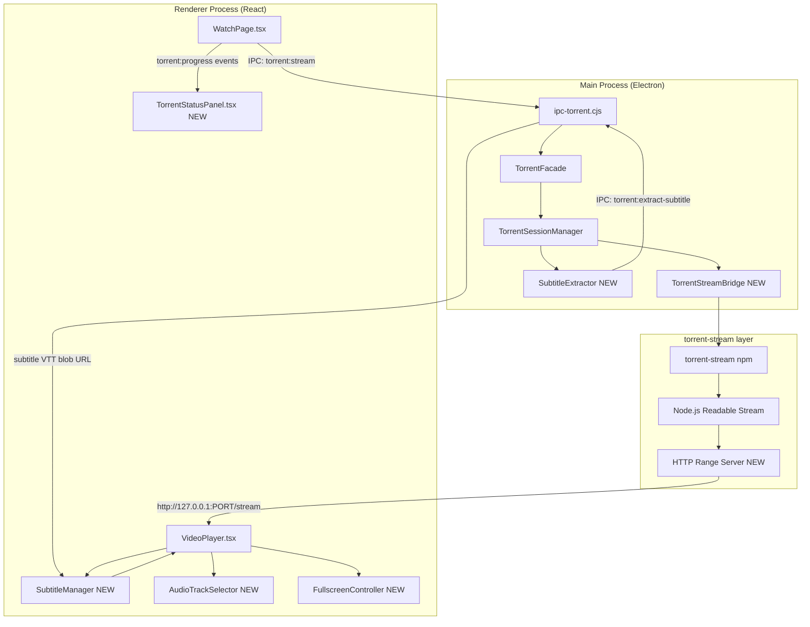
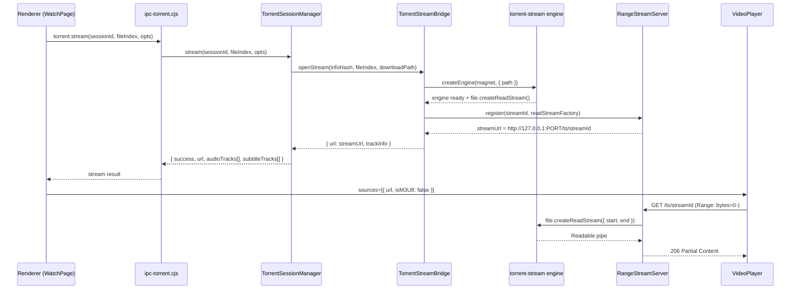
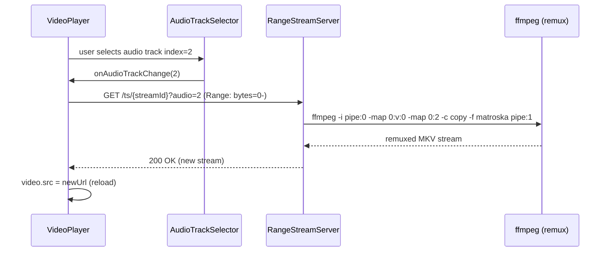
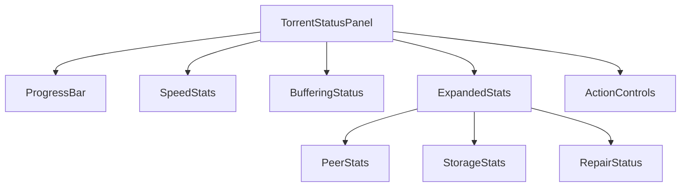
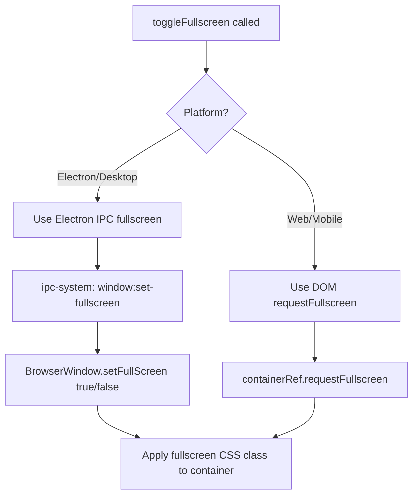

# Design Document: Torrent Streaming Overhaul

## Overview

This document covers three tightly related improvements to the TatakaiV5 Electron app's torrent playback system:

1. **Torrent Streaming Overhaul** — Fix MKV streaming reliability, migrate to `torrent-stream` for direct pipe-based streaming, eliminate duplicate subtitle tracks, and add full multi-track audio/subtitle selection inside the video player.
2. **Torrent Status Screen Redesign** — Replace the existing `TorrentStickyBanner` with a compact, glass-aesthetic HUD panel anchored center-top of the screen, showing all key stats without clutter.
3. **Fullscreen Mode Fix** — Ensure the video player enters true fullscreen correctly on Windows, macOS, and Linux, with proper aspect ratio, subtitle positioning, and overlay control preservation.

The existing system uses WebTorrent v2 (ESM) with an ffmpeg transcode server for MKV files. The core problem is that the transcode path is fragile: ffmpeg probes a sparse HTTP stream, subtitle tracks are duplicated because both the `<video>` element's native tracks and injected `<track>` elements coexist, and the fullscreen API call targets the container div rather than the Electron `BrowserWindow`.

---

## Architecture




---

## Part 1: Torrent Streaming Overhaul

### 1.1 Current Problems

| Problem | Root Cause |
|---|---|
| MKV playback fails or stalls | ffmpeg probes a sparse HTTP stream before enough pieces are downloaded; EBML header may be missing |
| Duplicate subtitle tracks | Both native `<video>` `textTracks` (from the MKV container via ffmpeg) and injected `<track>` elements are active simultaneously |
| No dub audio selection | The transcode server hardcodes `audioStreamIndex = 1`; no UI exposes multi-track selection |
| No subtitle track selection from MKV | `VideoSettingsPanel` has the UI but the extraction pipeline is incomplete for torrent sources |
| Transcode server is stateful and fragile | A single ffmpeg process per request; no graceful restart on seek |

### 1.2 Migration to `torrent-stream`

`torrent-stream` (npm: `torrent-stream`, types: `@types/torrent-stream`) provides a lower-level streaming API that exposes a Node.js `Readable` stream directly from the torrent file. This avoids the WebTorrent HTTP server layer and gives us a clean pipe to feed into our own HTTP range server.

**Why `torrent-stream` instead of WebTorrent's built-in server:**
- Direct `file.createReadStream({ start, end })` with byte-range support
- No intermediate HTTP hop between WebTorrent and ffmpeg
- Simpler piece prioritization — `engine.files[i].select()` + `engine.swarm.wires` access
- Compatible with existing magnet/infoHash inputs

**Coexistence strategy:** `torrent-stream` runs alongside WebTorrent. WebTorrent continues to handle session management, tracker repair, and progress events. `torrent-stream` is used only for the streaming pipe when a file is ready to play.

### 1.3 Sequence Diagram: MKV Streaming Flow




### 1.4 TorrentStreamBridge — Core Interface

```typescript
interface TorrentStreamBridge {
  /**
   * Opens a torrent-stream engine for the given infoHash/magnet.
   * Returns a stream URL and track metadata extracted via ffprobe.
   */
  openStream(
    infoHash: string,
    fileIndex: number,
    downloadPath: string,
    options?: StreamOptions
  ): Promise<StreamResult>

  /**
   * Creates a byte-range-capable HTTP response for a registered stream.
   * Called by the RangeStreamServer on each GET request.
   */
  createRangeResponse(
    streamId: string,
    rangeHeader: string | undefined
  ): RangeResponse

  /**
   * Extracts a subtitle track from the MKV as a VTT blob.
   * Returns a data: URL safe to use as a <track src>.
   */
  extractSubtitleTrack(
    streamId: string,
    trackIndex: number
  ): Promise<SubtitleExtractResult>

  /** Closes the engine and frees resources. */
  closeStream(streamId: string): void
}

interface StreamOptions {
  audioTrackIndex?: number   // default: first audio track
  startTime?: number         // seek offset in seconds
}

interface StreamResult {
  success: boolean
  url: string                // http://127.0.0.1:PORT/ts/{streamId}
  streamId: string
  name: string
  length: number
  fileIndex: number
  infoHash: string
  audioTracks: AudioTrackInfo[]
  subtitleTracks: SubtitleTrackInfo[]
  error?: string
}

interface AudioTrackInfo {
  index: number              // ffprobe stream index
  language: string           // BCP-47 code e.g. "en", "ja"
  title: string              // e.g. "English (AAC)", "Japanese (FLAC)"
  codec: string              // e.g. "aac", "flac", "opus"
  channels: number
  isDefault: boolean
}

interface SubtitleTrackInfo {
  index: number              // ffprobe stream index
  language: string
  title: string
  codec: string              // e.g. "ass", "subrip", "webvtt"
  isDefault: boolean
  isForced: boolean
}

interface RangeResponse {
  statusCode: 200 | 206
  headers: Record<string, string>
  stream: NodeJS.ReadableStream
}

interface SubtitleExtractResult {
  success: boolean
  vttDataUrl: string         // data:text/vtt;base64,...
  trackIndex: number
  language: string
  title: string
  error?: string
}
```


### 1.5 RangeStreamServer — HTTP Range Server

The `RangeStreamServer` is a lightweight `http.Server` that handles byte-range requests against registered `torrent-stream` file streams. It replaces the WebTorrent built-in server for the streaming path.

```typescript
interface RangeStreamServer {
  /** Start listening on a random port. Returns the port number. */
  listen(): Promise<number>

  /**
   * Register a stream factory for a given streamId.
   * The factory is called on each request (including range requests)
   * to create a fresh ReadStream with the correct start/end offsets.
   */
  register(
    streamId: string,
    factory: (start: number, end: number) => NodeJS.ReadableStream,
    totalLength: number
  ): void

  /** Remove a registered stream. */
  unregister(streamId: string): void

  close(): void
}
```

**Key behaviors:**
- Responds to `Range: bytes=X-Y` with `206 Partial Content`
- Responds to requests without Range header with `200 OK` (full stream)
- Sets `Content-Type: video/x-matroska` for `.mkv`, `video/mp4` for `.mp4`, etc.
- Sets `Accept-Ranges: bytes` and `Content-Length` on all responses
- CORS headers: `Access-Control-Allow-Origin: *` (loopback only)
- Each request creates a new `ReadStream` via the factory — no shared state

### 1.6 Track Metadata Extraction via ffprobe

After the torrent-stream engine has the first 4 MB of the file available, we run `ffprobe` to extract track metadata. This is a one-time operation per stream session.

```pascal
ALGORITHM extractTrackMetadata(filePath OR streamUrl)
INPUT: source — local file path or http://127.0.0.1:PORT/ts/streamId
OUTPUT: { audioTracks[], subtitleTracks[] }

BEGIN
  args ← [
    '-v', 'quiet',
    '-print_format', 'json',
    '-show_streams',
    '-analyzeduration', '3000000',
    '-probesize', '3000000',
    source
  ]

  result ← await spawnAsync(FFPROBE_PATH, args)
  parsed ← JSON.parse(result.stdout)

  audioTracks ← []
  subtitleTracks ← []

  FOR each stream IN parsed.streams DO
    IF stream.codec_type = 'audio' THEN
      audioTracks.push({
        index: stream.index,
        language: stream.tags?.language OR 'und',
        title: stream.tags?.title OR '',
        codec: stream.codec_name,
        channels: stream.channels OR 2,
        isDefault: stream.disposition?.default = 1
      })
    ELSE IF stream.codec_type = 'subtitle' THEN
      subtitleTracks.push({
        index: stream.index,
        language: stream.tags?.language OR 'und',
        title: stream.tags?.title OR '',
        codec: stream.codec_name,
        isDefault: stream.disposition?.default = 1,
        isForced: stream.disposition?.forced = 1
      })
    END IF
  END FOR

  RETURN { audioTracks, subtitleTracks }
END
```

**Preconditions:**
- `ffprobe` is available at `FFPROBE_PATH` (from `@ffmpeg-installer/ffmpeg`)
- At least 3 MB of the file is available (prebuffer check passes)

**Postconditions:**
- Returns arrays (possibly empty) — never throws
- Track indices match the ffmpeg `-map 0:INDEX` convention


### 1.7 Subtitle Extraction Algorithm

MKV subtitle tracks (ASS/SSA, SRT, WebVTT) are extracted on demand using ffmpeg and returned as `data:text/vtt;base64,...` URLs. This avoids writing temp files to disk.

```pascal
ALGORITHM extractSubtitleTrack(streamId, trackIndex)
INPUT: streamId — registered stream ID
       trackIndex — ffprobe stream index (e.g. 3)
OUTPUT: SubtitleExtractResult

BEGIN
  source ← resolveSource(streamId)  // local path or stream URL

  args ← [
    '-v', 'quiet',
    '-i', source,
    '-map', '0:' + trackIndex,
    '-f', 'webvtt',
    '-analyzeduration', '3000000',
    '-probesize', '3000000',
    'pipe:1'
  ]

  result ← await spawnAsync(FFMPEG_PATH, args, { captureStdout: true })

  IF result.exitCode ≠ 0 THEN
    // Fallback: try converting from ASS to VTT via intermediate SRT
    RETURN extractSubtitleFallback(source, trackIndex)
  END IF

  vttContent ← result.stdout.toString('utf8')
  vttDataUrl ← 'data:text/vtt;base64,' + Buffer.from(vttContent).toString('base64')

  RETURN {
    success: true,
    vttDataUrl,
    trackIndex,
    language: resolveTrackLanguage(streamId, trackIndex),
    title: resolveTrackTitle(streamId, trackIndex)
  }
END
```

**Preconditions:**
- `streamId` is registered in `TorrentStreamBridge`
- `trackIndex` is a valid subtitle stream index from `extractTrackMetadata`

**Postconditions:**
- Returns a `data:text/vtt;base64,...` URL on success
- Returns `{ success: false, error }` on failure — never throws
- The VTT content is valid and can be used as `<track src>`

### 1.8 Duplicate Subtitle Track Fix

The duplicate track problem occurs because:
1. The MKV container has embedded subtitle streams that the browser's `<video>` element exposes as `TextTrack` objects
2. The existing code also injects `<track>` elements for the same subtitles

**Fix strategy:**

```pascal
ALGORITHM deduplicateSubtitleTracks(videoElement, injectedTracks)
INPUT: videoElement — HTMLVideoElement
       injectedTracks — Array<{ lang, label, internalTrackId? }>
OUTPUT: filteredInjectedTracks — tracks to actually render as <track> elements

BEGIN
  nativeTracks ← Set of { lang: normalizeLanguage(t.language), label: t.label }
                 for each t in videoElement.textTracks
                 WHERE t.kind = 'subtitles' OR t.kind = 'captions'

  filteredInjectedTracks ← []

  FOR each track IN injectedTracks DO
    key ← normalizeLanguage(track.lang) + '|' + normalizeLabel(track.label)

    IF nativeTracks.has(key) THEN
      // Skip — native track already covers this
      CONTINUE
    END IF

    IF track.internalTrackId ≠ null THEN
      // This is an extracted internal track — always skip from <track> injection
      // It will be activated via textTracks[id].mode = 'showing' instead
      CONTINUE
    END IF

    filteredInjectedTracks.push(track)
  END FOR

  RETURN filteredInjectedTracks
END
```

**Key rule:** Internal subtitle tracks (from MKV extraction) are activated by setting `video.textTracks[id].mode = 'showing'` directly, never by injecting a `<track>` element. External subtitle tracks (from the API) are injected as `<track>` elements only if no native track with the same language exists.


### 1.9 Multi-Track Audio Selection

Audio track switching for torrent MKV sources works differently from HLS (which uses `audioTracks` API). For MKV via the range server, we re-request the stream with an `?audio=INDEX` query parameter that the `RangeStreamServer` passes to a lightweight ffmpeg remux.



**Audio remux ffmpeg args:**

```pascal
args ← [
  '-hide_banner', '-loglevel', 'error',
  '-analyzeduration', '3000000', '-probesize', '3000000',
  '-i', 'pipe:0',
  '-map', '0:v:0',
  '-map', '0:' + audioIndex,
  '-c:v', 'copy',
  '-c:a', 'copy',
  '-sn',
  '-movflags', 'frag_keyframe+empty_moov+default_base_moof',
  '-f', 'matroska',
  'pipe:1'
]
```

This remux is codec-copy (no re-encode), so it's near-instant and CPU-free.

### 1.10 IPC Channel Extensions

New IPC channels added to `ipc-torrent.cjs`:

| Channel | Direction | Payload | Response |
|---|---|---|---|
| `torrent:stream-v2` | invoke | `{ sessionId, fileIndex, audioTrackIndex?, startTime? }` | `StreamResult` |
| `torrent:extract-subtitle` | invoke | `{ sessionId, streamId, trackIndex }` | `SubtitleExtractResult` |
| `torrent:track-info` | invoke | `{ sessionId, streamId }` | `{ audioTracks[], subtitleTracks[] }` |
| `torrent:stream-audio-switch` | invoke | `{ streamId, audioTrackIndex }` | `{ success, newUrl }` |

The existing `torrent:stream` channel is preserved for backward compatibility. `torrent:stream-v2` is used when the source is an MKV file.

---

## Part 2: Torrent Status Screen Redesign

### 2.1 Design Goals

- **Compact**: Maximum height ~80px in collapsed state, ~160px expanded
- **Glass aesthetic**: `backdrop-blur-xl`, `bg-background/60`, `border-white/10` — matches `GlassPanel` system
- **Center-top positioning**: `fixed top-4 left-1/2 -translate-x-1/2` — floats above content
- **Non-intrusive**: Auto-collapses when download is complete or player is fullscreen
- **Advanced stats on demand**: Expand toggle reveals seeders/leechers, storage, repair status

### 2.2 Component Architecture




### 2.3 TorrentStatusPanel Interface

```typescript
interface TorrentStatusPanelProps {
  sessionId: string
  stats: TorrentLiveStats | null
  isBuffering: boolean
  onRepair: () => void
  onStop: () => void
  /** Hide panel when player is in fullscreen */
  isFullscreen?: boolean
}

interface TorrentLiveStats {
  // Core progress
  progress: number           // 0–100
  downloadSpeed: number      // bytes/s
  uploadSpeed: number        // bytes/s
  numPeers: number
  seeders: number
  leechers: number
  eta: number | null         // seconds, null = unknown
  done: boolean
  verified: boolean

  // File info
  name: string
  fileName: string
  infoHash: string
  fileIndex: number

  // Storage
  storage: {
    totalBytes: number
    usedBytes: number
    freeBytes: number
  } | number                 // legacy: raw bytes

  // Status
  availability: 'active' | 'no_peers'
  availabilityMessage: string | null
  stalledForMs: number
  repair: {
    at: number
    reason: string
    action: string
    attempts: number
  } | null
}
```

### 2.4 Visual Layout Specification

**Collapsed state (default):**

```
┌─────────────────────────────────────────────────────────────┐
│  ↓ 1.2 MB/s  ↑ 0.1 MB/s  ●●●●●●●░░░░  64%  ETA 2m 14s  ⌄ │
└─────────────────────────────────────────────────────────────┘
```

- Width: `min(480px, 90vw)`
- Height: `48px`
- Background: `bg-background/60 backdrop-blur-xl border border-white/10`
- Border radius: `rounded-2xl`
- Shadow: `shadow-2xl shadow-black/30`
- Progress bar: thin `2px` line at the bottom of the pill, colored `bg-primary`

**Expanded state (on click):**

```
┌─────────────────────────────────────────────────────────────┐
│  ↓ 1.2 MB/s  ↑ 0.1 MB/s  ●●●●●●●░░░░  64%  ETA 2m 14s  ⌃ │
├─────────────────────────────────────────────────────────────┤
│  Peers: 12  Seeders: 8  Leechers: 4  Cache: 2.1 GB         │
│  [Buffering...] [Repair] [Stop]                             │
└─────────────────────────────────────────────────────────────┘
```

- Height: `~140px`
- Expanded section uses `grid grid-cols-4 gap-3` for stats
- Smooth height transition: `transition-all duration-300 ease-out`

### 2.5 Buffering Status Indicator

The buffering status is derived from the combination of `isBuffering` prop (from VideoPlayer) and `torrentLiveStats`:

```pascal
FUNCTION deriveBufferingStatus(isBuffering, stats)
INPUT: isBuffering — boolean from VideoPlayer
       stats — TorrentLiveStats

BEGIN
  IF stats = null THEN RETURN 'connecting'
  IF stats.availability = 'no_peers' THEN RETURN 'no_peers'
  IF stats.done AND stats.verified THEN RETURN 'complete'
  IF isBuffering AND stats.downloadSpeed > 0 THEN RETURN 'buffering_downloading'
  IF isBuffering AND stats.downloadSpeed = 0 THEN RETURN 'buffering_stalled'
  IF stats.stalledForMs > 45000 THEN RETURN 'stalled'
  IF stats.repair ≠ null AND (now - stats.repair.at) < 120000 THEN RETURN 'repairing'
  RETURN 'downloading'
END
```

Status → visual mapping:

| Status | Icon | Color | Label |
|---|---|---|---|
| `connecting` | `Loader2` (spin) | `text-muted-foreground` | Connecting… |
| `downloading` | `Download` | `text-primary` | Downloading |
| `buffering_downloading` | `Loader2` (spin) | `text-amber-400` | Buffering |
| `buffering_stalled` | `AlertCircle` | `text-orange-400` | Stalled |
| `stalled` | `AlertCircle` | `text-orange-400` | Stalled Xs |
| `repairing` | `RefreshCw` (spin) | `text-yellow-400` | Repairing |
| `no_peers` | `WifiOff` | `text-red-400` | No peers |
| `complete` | `CheckCircle` | `text-green-400` | Complete |


### 2.6 ETA Formatting

```pascal
FUNCTION formatEta(etaSeconds)
INPUT: etaSeconds — number | null

BEGIN
  IF etaSeconds = null THEN RETURN '—'
  IF etaSeconds = 0 THEN RETURN 'Done'
  IF etaSeconds < 60 THEN RETURN etaSeconds + 's'
  IF etaSeconds < 3600 THEN
    mins ← floor(etaSeconds / 60)
    secs ← etaSeconds mod 60
    RETURN mins + 'm ' + secs + 's'
  END IF
  hours ← floor(etaSeconds / 3600)
  mins ← floor((etaSeconds mod 3600) / 60)
  RETURN hours + 'h ' + mins + 'm'
END
```

### 2.7 Panel Visibility Rules

```pascal
ALGORITHM shouldShowPanel(sessionId, stats, isFullscreen, isComplete)

BEGIN
  IF sessionId = '' OR sessionId = null THEN RETURN false
  IF isFullscreen THEN RETURN false
  IF isComplete AND timeSinceComplete > 5000ms THEN RETURN false
  RETURN true
END
```

The panel auto-hides 5 seconds after `stats.done && stats.verified` becomes true, using a `useEffect` with a `setTimeout`.

---

## Part 3: Fullscreen Mode Fix

### 3.1 Current Problems

| Problem | Root Cause |
|---|---|
| Fullscreen doesn't work on some Linux DEs | `requestFullscreen()` on a `<div>` inside Electron may be blocked by the compositor |
| Aspect ratio breaks in fullscreen | The container uses `aspect-video` which conflicts with `position: fixed` in fullscreen |
| Subtitles reposition incorrectly | Subtitle overlay uses `bottom-16` which is relative to the container, not the viewport |
| Controls disappear in fullscreen | The controls overlay `z-index` is lower than the fullscreen stacking context |
| macOS: native fullscreen vs. web fullscreen conflict | Electron's `BrowserWindow.setFullScreen()` and the DOM `requestFullscreen()` API fight each other |

### 3.2 Fullscreen Strategy by Platform



**Electron path (preferred for desktop):**

Instead of calling `document.requestFullscreen()` on the container div, we call `window.tatakaiRuntime.setWindowFullscreen(true)` which triggers `BrowserWindow.setFullScreen(true)` in the main process. The renderer then applies a CSS class `data-fullscreen="true"` to the video container to make it fill the window.

This avoids the browser's fullscreen API entirely on Electron, which is the source of most cross-platform issues.

### 3.3 FullscreenController Interface

```typescript
interface FullscreenController {
  isFullscreen: boolean
  toggle(): Promise<void>
  enter(): Promise<void>
  exit(): Promise<void>
}

// Hook
function useFullscreen(
  containerRef: React.RefObject<HTMLDivElement>,
  isNative: boolean
): FullscreenController
```


### 3.4 Fullscreen Algorithm

```pascal
ALGORITHM toggleFullscreen(containerRef, isNative, isFullscreen)
INPUT: containerRef — React ref to the video container div
       isNative — boolean (true = Electron desktop)
       isFullscreen — current state

BEGIN
  IF isNative THEN
    // Electron path: use BrowserWindow.setFullScreen
    runtime ← window.tatakaiRuntime
    IF isFullscreen THEN
      await runtime.setWindowFullscreen(false)
      containerRef.current.removeAttribute('data-fullscreen')
    ELSE
      await runtime.setWindowFullscreen(true)
      containerRef.current.setAttribute('data-fullscreen', 'true')
    END IF
  ELSE
    // Web path: use DOM Fullscreen API
    IF isFullscreen THEN
      IF document.exitFullscreen THEN
        await document.exitFullscreen()
      ELSE IF document.webkitExitFullscreen THEN
        await document.webkitExitFullscreen()
      END IF
    ELSE
      IF containerRef.current.requestFullscreen THEN
        await containerRef.current.requestFullscreen()
      ELSE IF containerRef.current.webkitRequestFullscreen THEN
        await containerRef.current.webkitRequestFullscreen()
      END IF
    END IF
  END IF
END
```

**Preconditions:**
- `containerRef.current` is not null
- On Electron: `window.tatakaiRuntime.setWindowFullscreen` is available

**Postconditions:**
- `isFullscreen` state is updated via the `fullscreenchange` event listener (web) or IPC event (Electron)
- The container has `data-fullscreen="true"` attribute when fullscreen is active

### 3.5 Fullscreen CSS

The fullscreen container uses CSS that works for both the DOM Fullscreen API and the Electron `data-fullscreen` attribute approach:

```css
/* Applied when fullscreen is active (either path) */
.video-container[data-fullscreen="true"],
.video-container:fullscreen,
.video-container:-webkit-full-screen {
  position: fixed;
  inset: 0;
  width: 100vw;
  height: 100vh;
  z-index: 9999;
  background: #000;
  border-radius: 0;
}

/* Video element fills container with letterboxing */
.video-container[data-fullscreen="true"] video,
.video-container:fullscreen video,
.video-container:-webkit-full-screen video {
  width: 100%;
  height: 100%;
  object-fit: contain;  /* preserves aspect ratio */
}

/* Subtitle overlay: always relative to the video container */
.video-container[data-fullscreen="true"] .subtitle-overlay,
.video-container:fullscreen .subtitle-overlay,
.video-container:-webkit-full-screen .subtitle-overlay {
  position: absolute;
  bottom: 80px;  /* above controls */
  left: 50%;
  transform: translateX(-50%);
  width: 80%;
  text-align: center;
  z-index: 10000;
}

/* Controls overlay: always on top */
.video-container[data-fullscreen="true"] .controls-overlay,
.video-container:fullscreen .controls-overlay,
.video-container:-webkit-full-screen .controls-overlay {
  position: absolute;
  bottom: 0;
  left: 0;
  right: 0;
  z-index: 10001;
}
```

### 3.6 IPC Extension for Fullscreen

New IPC channel in `ipc-system.cjs`:

```javascript
ipcMain.handle('window:set-fullscreen', (_event, value) => {
  const win = getMainWindow()
  if (!win || win.isDestroyed()) return { success: false }
  win.setFullScreen(Boolean(value))
  return { success: true, isFullscreen: win.isFullScreen() }
})

ipcMain.handle('window:is-fullscreen', () => {
  const win = getMainWindow()
  if (!win || win.isDestroyed()) return { isFullscreen: false }
  return { isFullscreen: win.isFullScreen() }
})
```

Preload bridge addition in `preload.cjs`:

```javascript
setWindowFullscreen: (value) => ipcRenderer.invoke('window:set-fullscreen', value),
isWindowFullscreen: () => ipcRenderer.invoke('window:is-fullscreen'),
onWindowFullscreenChange: (cb) => {
  ipcRenderer.on('window:fullscreen-changed', (_e, data) => cb(data))
  return () => ipcRenderer.removeAllListeners('window:fullscreen-changed')
},
```

The main window emits `window:fullscreen-changed` on the `enter-full-screen` and `leave-full-screen` BrowserWindow events so the renderer can sync state.


### 3.7 Subtitle Positioning in Fullscreen

The subtitle overlay must remain correctly positioned regardless of fullscreen mode. The current implementation uses Tailwind classes like `bottom-16` which are relative to the container. In fullscreen, the container is `100vh` tall, so `bottom-16` (64px) is correct — but only if the controls overlay is also 64px tall.

**Fix:** Use CSS custom properties to keep subtitle and controls in sync:

```css
.video-container {
  --controls-height: 64px;
}

.subtitle-overlay {
  bottom: calc(var(--controls-height) + 16px);
}
```

When controls are hidden (auto-hide after 3s), `--controls-height` is set to `0px` via JavaScript, and the subtitle slides down smoothly.

---

## Part 4: Data Models

### 4.1 Torrent Stream Session (Extended)

```typescript
interface TorrentStreamSession {
  sessionId: string
  infoHash: string
  magnet: string
  name: string
  targetFileIndex: number
  selectedFile: TorrentFileInfo
  playableFiles: TorrentFileInfo[]
  detectedEpisodes: number[]
  seasonOrganization: SeasonInfo[]

  // NEW: stream bridge state
  streamId: string | null          // registered in RangeStreamServer
  audioTracks: AudioTrackInfo[]    // from ffprobe
  subtitleTracks: SubtitleTrackInfo[]
  activeAudioTrackIndex: number
  activeSubtitleTrackIndex: number | null

  // Progress
  startedAt: number
  lastProgressAt: number
  progress: number
  downloadSpeed: number
  uploadSpeed: number
  numPeers: number
  seeders: number
  leechers: number
  eta: number | null
  done: boolean
  verified: boolean
  storage: StorageUsage
}
```

### 4.2 Renderer Torrent State (WatchPage)

```typescript
interface TorrentPlaybackState {
  sessionId: string
  source: TorrentPlaybackSource | null
  loading: boolean
  error: string | null
  liveStats: TorrentLiveStats | null
  retryTrigger: number
  autoRepairCount: number

  // NEW: multi-track state
  availableAudioTracks: AudioTrackInfo[]
  availableSubtitleTracks: SubtitleTrackInfo[]
  activeAudioTrackIndex: number
  activeSubtitleTrackIndex: number | null
  streamId: string | null
}
```

---

## Part 5: Error Handling

### 5.1 Streaming Error Scenarios

| Scenario | Detection | Recovery |
|---|---|---|
| torrent-stream engine fails to start | `engine.on('error')` | Fall back to WebTorrent HTTP server |
| ffprobe fails (no binary) | `spawnAsync` rejects | Return empty track arrays; stream without track info |
| Subtitle extraction fails | ffmpeg exit code ≠ 0 | Try ASS→SRT→VTT fallback; show error toast |
| Range server port conflict | `listen()` rejects | Retry on next available port (up to 5 attempts) |
| Audio track switch causes decode error | `video.onerror` | Revert to previous audio track index |
| Fullscreen IPC fails | `setWindowFullscreen` returns `{ success: false }` | Fall back to DOM `requestFullscreen()` |

### 5.2 Graceful Degradation

```pascal
ALGORITHM resolveStreamWithFallback(sessionId, fileIndex, opts)

BEGIN
  // Try torrent-stream path first (for MKV)
  IF file.extension = 'mkv' OR file.extension = 'webm' THEN
    result ← await TorrentStreamBridge.openStream(infoHash, fileIndex, downloadPath, opts)
    IF result.success THEN RETURN result
    logger.warn('torrent-stream failed, falling back to transcode server')
  END IF

  // Fall back to existing transcode server
  result ← await ensureTranscodeServer()
  RETURN buildTranscodeUrl(sessionId, fileIndex, opts)
END
```

---

## Part 6: Testing Strategy

### 6.1 Unit Testing Approach

- `TorrentStreamBridge.openStream()`: mock `torrent-stream` engine, verify stream URL format
- `RangeStreamServer`: test byte-range parsing, 206 response headers, CORS headers
- `extractTrackMetadata()`: mock ffprobe output, verify track array parsing
- `extractSubtitleTrack()`: mock ffmpeg output, verify VTT data URL format
- `deduplicateSubtitleTracks()`: property test with arbitrary track arrays
- `deriveBufferingStatus()`: table-driven tests for all status combinations
- `formatEta()`: property test — `∀ n ≥ 0: formatEta(n)` returns a non-empty string
- `useFullscreen()`: mock `tatakaiRuntime`, verify state transitions

### 6.2 Property-Based Testing

**Property test library:** `fast-check` (already used in the project)

**Properties to test:**

```typescript
// P1: deduplicateSubtitleTracks never loses external tracks
// ∀ injectedTracks: filtered.length ≤ injectedTracks.length
// AND all external tracks (no internalTrackId) with unique lang are preserved

// P2: RangeStreamServer byte-range responses are consistent
// ∀ (start, end, totalLength): response.headers['Content-Range'] = `bytes ${start}-${end}/${totalLength}`
// AND response.statusCode = 206

// P3: formatEta is total
// ∀ n ∈ [0, Number.MAX_SAFE_INTEGER]: typeof formatEta(n) = 'string' AND formatEta(n).length > 0

// P4: TorrentStatusPanel progress bar width is bounded
// ∀ progress ∈ [0, 100]: progressBarWidth = `${progress}%` is a valid CSS value
```

### 6.3 Integration Testing

- Full torrent stream flow: start session → wait prebuffer → open stream → verify HTTP range response
- Audio track switch: open stream → switch audio → verify new URL contains `?audio=N`
- Subtitle extraction: open MKV stream → extract subtitle track 3 → verify VTT data URL
- Fullscreen on Electron: mock `BrowserWindow.setFullScreen` → verify `data-fullscreen` attribute

---

## Part 7: Performance Considerations

- **torrent-stream engine startup**: ~200ms for magnet metadata if already cached; the existing WebTorrent session has already resolved metadata, so we pass the `infoHash` directly
- **ffprobe track extraction**: ~300ms on a 4 MB prebuffer; run once per stream session and cache results
- **Subtitle extraction**: ~500ms for a typical ASS track; run on demand, cache in `extractedSubtitleCacheRef`
- **Range server**: Each request creates a new `ReadStream` — this is intentional for correctness; Node.js streams are cheap to create
- **Audio track switch**: Causes a video reload (new `src`); seek position is preserved by passing `?start=currentTime`

---

## Part 8: Security Considerations

- The `RangeStreamServer` binds to `127.0.0.1` only — not accessible from the network
- Stream IDs are random UUIDs — not guessable
- Subtitle VTT content is returned as `data:` URLs — no file system exposure
- ffmpeg/ffprobe are invoked with explicit argument arrays — no shell injection possible
- The `window:set-fullscreen` IPC channel validates that the caller is the main window

---

## Part 9: Dependencies

| Package | Version | Purpose |
|---|---|---|
| `torrent-stream` | `^2.0.0` | Direct stream pipe from torrent files |
| `@types/torrent-stream` | `^2.0.0` | TypeScript types |
| `@ffmpeg-installer/ffmpeg` | existing | ffmpeg binary (already installed) |
| `fast-check` | existing | Property-based testing |

No new renderer-side dependencies are required. All new packages are in `desktop/package.json`.


---

## Part 10: Correctness Properties

*A property is a characteristic or behavior that should hold true across all valid executions of a system — essentially, a formal statement about what the system should do. Properties serve as the bridge between human-readable specifications and machine-verifiable correctness guarantees.*

### Property 1: Stream URL Format

*For any* valid `fileIndex` and mock `infoHash`, when `TorrentStreamBridge.openStream()` succeeds it must return a URL matching `http://127.0.0.1:{PORT}/ts/{streamId}` where `streamId` is a non-empty UUID string.

```typescript
// fast-check property
fc.assert(fc.asyncProperty(
  fc.string({ minLength: 1 }),
  fc.nat({ max: 20 }),
  async (sessionId, fileIndex) => {
    const result = await bridge.openStream(mockInfoHash, fileIndex, mockPath)
    if (!result.success) return true // skip failed cases
    return /^http:\/\/127\.0\.0\.1:\d+\/ts\/[a-z0-9-]+$/.test(result.url)
  }
))
```

**Validates: Requirements 1.2**

---

### Property 2: RangeStreamServer Content-Range Header

*For any* valid byte range `(start, end, totalLength)` where `0 ≤ start ≤ end < totalLength`, the RangeStreamServer must respond with `Content-Range: bytes start-end/totalLength` and HTTP status `206`.

```typescript
fc.assert(fc.asyncProperty(
  fc.nat({ max: 1000000 }).chain(total =>
    fc.tuple(
      fc.nat({ max: total - 1 }),
      fc.nat({ max: total - 1 })
    ).map(([a, b]) => ({ start: Math.min(a, b), end: Math.max(a, b), total }))
  ),
  async ({ start, end, total }) => {
    const response = await fetch(streamUrl, {
      headers: { Range: `bytes=${start}-${end}` }
    })
    return response.status === 206 &&
           response.headers.get('Content-Range') === `bytes ${start}-${end}/${total}`
  }
))
```

**Validates: Requirements 1.3**

---

### Property 3: Subtitle Deduplication Invariant

*For any* array of injected subtitle tracks, the deduplicated output must satisfy:
- `filtered.length ≤ input.length`
- No two tracks in the output share the same `(normalizeLanguage(lang), normalizeLabel(label))` key

```typescript
fc.assert(fc.property(
  fc.array(fc.record({
    lang: fc.string(),
    label: fc.option(fc.string()),
    internalTrackId: fc.option(fc.nat())
  })),
  (tracks) => {
    const filtered = deduplicateSubtitleTracks(tracks, new Set())
    const keys = filtered.map(t => getSubtitleDisplayKey(t))
    return filtered.length <= tracks.length &&
           new Set(keys).size === keys.length
  }
))
```

**Validates: Requirements 3.3, 3.4**

---

### Property 4: Subtitle VTT Data URL Format

*For any* successful subtitle extraction, the result must be a valid `data:text/vtt;base64,...` URL with non-empty base64 content.

```typescript
fc.assert(fc.asyncProperty(
  fc.nat({ max: 10 }), // track index
  async (trackIndex) => {
    const result = await bridge.extractSubtitleTrack(mockStreamId, trackIndex)
    if (!result.success) return true // skip failed cases
    return result.vttDataUrl.startsWith('data:text/vtt;base64,') &&
           result.vttDataUrl.length > 'data:text/vtt;base64,'.length
  }
))
```

**Validates: Requirements 3.1**

---

### Property 5: ETA Formatting is Total

*For any* non-negative finite integer, `formatEta` returns a non-empty string.

```typescript
fc.assert(fc.property(
  fc.nat({ max: 86400 * 7 }), // up to 1 week
  (seconds) => {
    const result = formatEta(seconds)
    return typeof result === 'string' && result.length > 0
  }
))
```

**Validates: Requirements 8.6**

---

### Property 6: Progress Bar Width is Bounded

*For any* `progress` value in `[0, 100]`, the progress bar width CSS value must be a valid percentage string with a numeric value in `[0, 100]`.

```typescript
fc.assert(fc.property(
  fc.float({ min: 0, max: 100, noNaN: true }),
  (progress) => {
    const clamped = Math.max(0, Math.min(100, progress))
    const width = `${clamped.toFixed(1)}%`
    return /^\d+(\.\d+)?%$/.test(width) && parseFloat(width) >= 0 && parseFloat(width) <= 100
  }
))
```

**Validates: Requirements 6.3**

---

### Property 7: BufferingStatusDeriver is Total

*For any* combination of `isBuffering` (boolean) and `stats` (valid `TorrentLiveStats` or null), `deriveBufferingStatus` must return one of the eight defined status values and never throw.

```typescript
fc.assert(fc.property(
  fc.boolean(),
  fc.option(fc.record({
    availability: fc.constantFrom('active', 'no_peers'),
    done: fc.boolean(),
    verified: fc.boolean(),
    downloadSpeed: fc.nat(),
    stalledForMs: fc.nat(),
    repair: fc.option(fc.record({ at: fc.nat(), reason: fc.string(), action: fc.string(), attempts: fc.nat() }))
  })),
  (isBuffering, stats) => {
    const VALID_STATUSES = new Set([
      'connecting', 'downloading', 'buffering_downloading',
      'buffering_stalled', 'stalled', 'repairing', 'no_peers', 'complete'
    ])
    const result = deriveBufferingStatus(isBuffering, stats)
    return VALID_STATUSES.has(result)
  }
))
```

**Validates: Requirements 7.8**

---

### Property 8: Fullscreen Toggle Round-Trip

*For any* initial fullscreen state, toggling fullscreen twice (enter then exit) must return the video container to its original state with no `data-fullscreen` attribute.

```typescript
fc.assert(fc.asyncProperty(
  fc.boolean(), // initial isFullscreen state
  async (startFullscreen) => {
    const container = document.createElement('div')
    const controller = createFullscreenController(container, /* isNative */ false)
    if (startFullscreen) await controller.enter()
    // Toggle in
    await controller.enter()
    const hasAttr = container.getAttribute('data-fullscreen') === 'true'
    // Toggle out
    await controller.exit()
    const noAttr = !container.hasAttribute('data-fullscreen')
    return hasAttr && noAttr
  }
))
```

**Validates: Requirements 9.2, 9.3**

