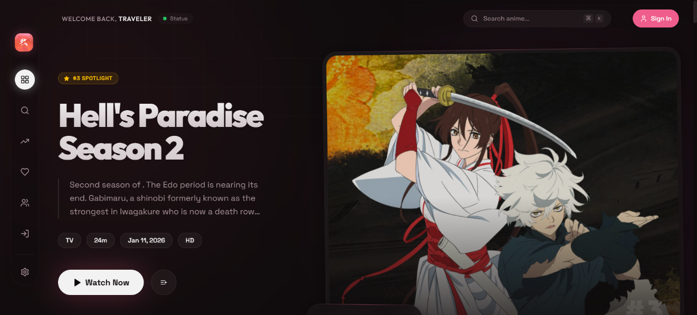
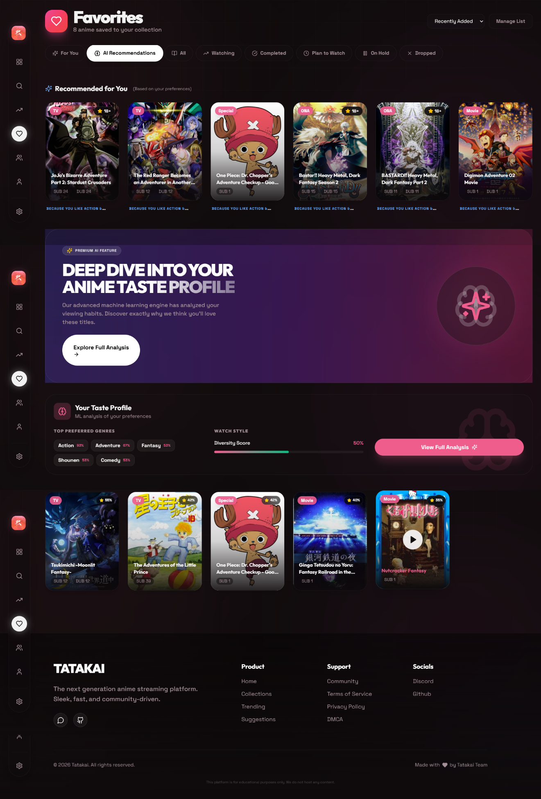
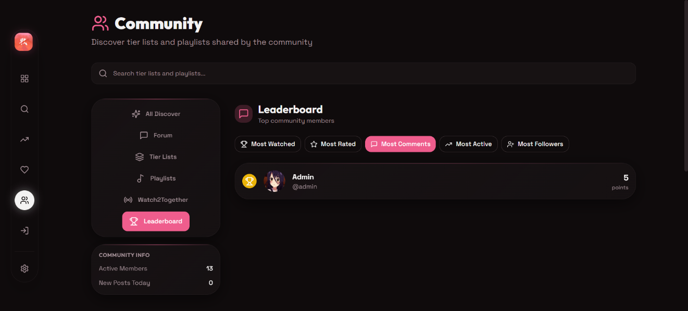
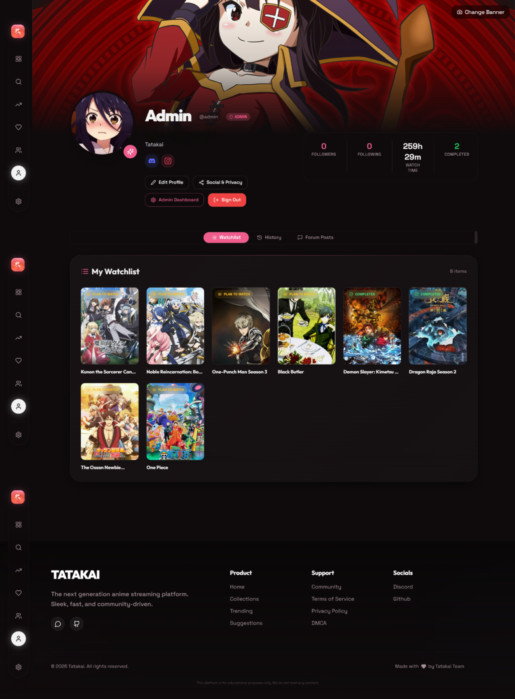

# Tatakai

<div align="center">
  
  
  
  
  
</div>

<div align="center">
  <h3>The Next Generation Anime Streaming Platform</h3>
  <p>Cross-platform (web, desktop & Android) — fast, accessible and community-driven.</p>
</div>

## 📸 Preview

> Screenshots below are high-resolution captures from the running app (web/Desktop/PWA). Click any image to view full size.


*Home — featured/spotlight anime, trending sections and personalized feed.*

---


*AI Recommendations — ML-powered suggestions based on your watching history.*

---


*Community — forum threads, comments and social interactions.*

---


*Profile — user settings, playlists and watch history.*


## Table of contents
- Features
- Quick start
- Platforms (Web / Desktop / Android)
- Configuration & secrets
- Development & testing
- CI / Release process
- Troubleshooting
- Contributing & governance

---

## Features

This project contains a large feature set focused on discovery, community and cross-platform playback. Key highlights are listed below.

### Community Tab
- Community Server: users can add fan-made video servers (dubs/subtitle sources) which become available to others after moderator verification.
- Tierlist: create and share ranked lists (example: assemble the correct Fate series order).
- Watch2Together: synchronous viewing / watch parties with friends.
- Forum (Reddit-style): threaded discussions and replies.
- Leaderboard: activity / contribution rankings for community engagement.
- Playlists: create public or private playlists (custom ordering supported).
- Follow/Profile System: follow users, inspect profiles and watchlists.

### Integration
- Auto-sync with MyAnimeList and AniList — import/export watchlists and keep progress in sync.

### Dubs (expanded)
- Coverage expanded from ~8 to 13 languages.
- Scraping: ~30 servers and 14 websites are scraped, including major sources (animekai, animelok, animepahe, etc.).
- Newly added dubs: German, French, Polish, Hindi, Telugu, Malayalam, English — and more coming.

### Video Player
- Use your own subtitles (upload/load local subtitle files).
- Default servers serve 1080p (HD) streams where available.
- Core features: adaptive quality, subtitle selection, custom action buttons and background playback support.

### Appearance
- Lite Mode: disable animations and gradients to boost performance on low-end devices.
- Theme options: 25+ selectable themes (light/dark + accent variants).

### Custom Recommendation
- Personalized recommendations powered by an ML algorithm using watch history and engagement signals.

### Search
- Visual search via Trace.moe integration — search by screenshot/image to find corresponding anime.

---


## Quick start (local)
1. Clone and install
```bash
git clone https://github.com/Snozxyx/Tatakai.git
cd Tatakai
npm ci
```

2. Copy env and add keys
```bash
cp .env.example .env
# edit .env with VITE_SUPABASE_URL and VITE_SUPABASE_ANON_KEY etc.
```

3. Run development server
```bash
npm run dev
# open http://localhost:8088
```

4. Run unit/type checks
```bash
npm run lint
# add type-check script if needed: npm run type-check
```

---

## Platforms
### Web (PWA)
- Built with Vite + React + Tailwind.
- To build production web assets:
```bash
npm run build
npm run preview
```
- PWA support is included; manifest and service worker are in `public/`.

### Desktop (Electron)
- Electron app packaged with `electron-builder`.
- Development: `npm run electron:dev` (runs Vite + Electron)
- Build: `npm run electron:build`
- Auto-update is configured using GitHub Releases and `electron-updater`.

### Android (Capacitor) [Under Development]
- Capacitor is used to create Android project under `android/`.
- Local dev flow:
  1. `npm run build` (produces web assets)
  2. `npm run mobile:sync` or `npm run mobile:dev`
  3. Open/Run in Android Studio or `cd android && ./gradlew assembleRelease`
- CI signing: workflow reads `ANDROID_KEYSTORE`, `KEYSTORE_PASSWORD`, `KEY_ALIAS`, `KEY_PASSWORD` secrets.

---

## Configuration & required secrets
- Environment variables (.env / Vercel):
  - VITE_SUPABASE_URL
  - VITE_SUPABASE_ANON_KEY
  - VITE_GA_MEASUREMENT_ID (optional)
  - VITE_DD_CLIENT_TOKEN (optional)
- GitHub Actions secrets (for release CI):
  - GH_PAT (personal access token for publishing desktop installers)
  - ANDROID_KEYSTORE (base64-encoded keystore file)
  - KEYSTORE_PASSWORD
  - KEY_ALIAS
  - KEY_PASSWORD

How to add Android keystore to GitHub Actions (recommended):
1. Base64-encode your `release.keystore`:
```bash
base64 release.keystore | pbcopy  # or redirect to file
```
2. In repo Settings → Secrets → Actions, add `ANDROID_KEYSTORE` and the other key variables.

Security note: Do NOT commit keystore files or secrets to the repository. Use GitHub Secrets or CI artifacts.

---

## CI / Release process (GitHub Actions)
- Workflow: `.github/workflows/build.yml`
- Jobs:
  - build-desktop → builds Electron packages and optionally publishes on tag
  - build-android → builds unsigned/signed APKs (signing runs only when `ANDROID_KEYSTORE` secret exists)
  - release → collects artifacts and attaches APK to GitHub Release when tagging

Tag-release flow:
1. Create a tag (e.g. `v4.1.0`) and push
2. Actions build desktop installers and Android APK (if secrets present)
3. Release job uploads artifacts and updates the GitHub Release

---

## Development & testing
- Primary scripts (see `package.json`):
  - `npm run dev` — start Vite dev server
  - `npm run build` — production build
  - `npm run preview` — serve production build locally
  - `npm run mobile:dev` / `mobile:sync` — Capacitor workflows
  - `npm run electron:dev` / `electron:build` — Electron workflows

- Tests: Add unit/integration tests under `src/` and wire any test runner (Jest/Playwright) as needed.

---

## Troubleshooting (common issues)
- Android Lint failures during `gradlew assembleRelease` — often caused by incorrect manifest entries or missing service classes. Example fix committed: register `AndroidForegroundService` in `android/app/src/main/AndroidManifest.xml`.
- CI secret expression errors — ensure `secrets.*` are referenced directly in workflow `if:` conditions.
- Large binary files (APK, keystore) accidentally committed — remove with `git rm` and add to `.gitignore`; rotate keys if a keystore was exposed.

If you hit a problem not covered here, open an issue with logs and steps-to-reproduce.

---

## Release checklist
1. Bump `package.json` version
2. Create a Git tag `vX.Y.Z`
3. Push tag to origin → GitHub Actions runs release pipeline
4. Verify artifacts in Release and CI logs

---

## Contributing & governance
- Please follow the commit message guidelines and use feature branches.
- Open PRs against `main` or the appropriate release branch.
- Add tests for new features and update documentation.

Code of conduct: Be respectful. Report violations to repo maintainers.

---

## Maintainers
- Primary: Snozxyx (GitHub)

## License
- MIT (see top-level LICENSE file if present)

---

## Where to get help
- Open an issue on GitHub
- For security-sensitive issues (exposed keys), email the maintainer directly or open a private security issue

---

<p align="center">Made with ❤️ for anime fans — contributions welcome</p>