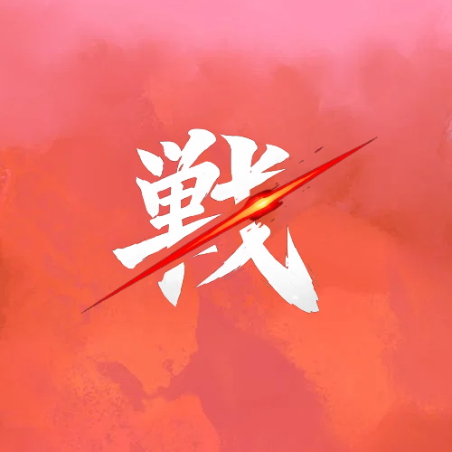
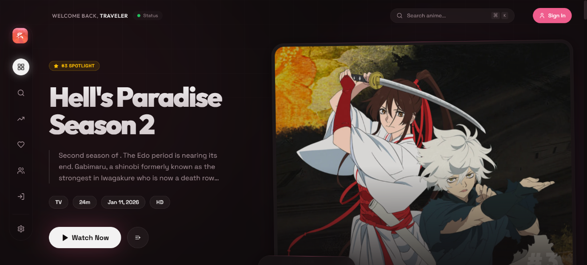
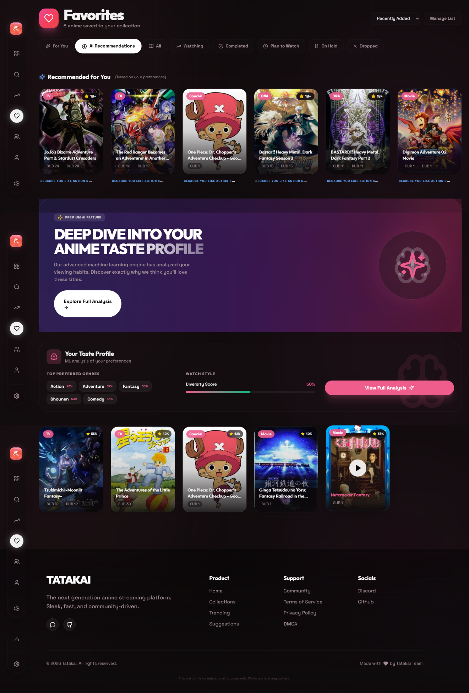
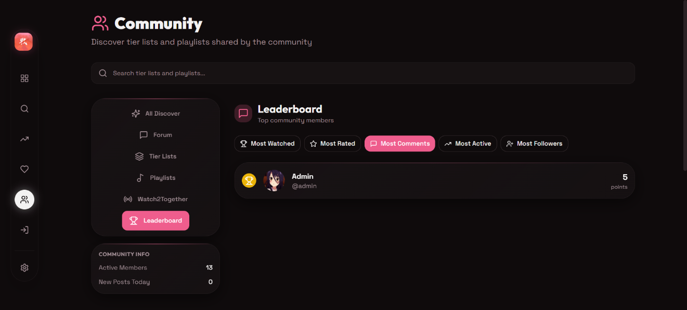
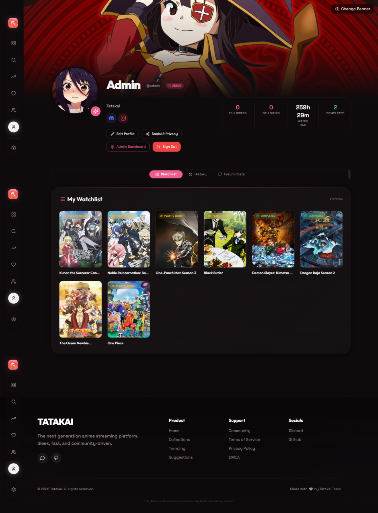

# Tatakai

  
  
  
  
  

  
  <h1>Tatakai</h1>

  <h3>The Next Generation Anime Streaming/Manga Platform</h3>
  
Cross-platform (web, desktop & Android (Soon)) — fast, accessible and community-driven.

---

## Social

- Discord: https://dsc.gg/tatakai  

---

## Disclaimer

- No other social media handle is available right now. If you see any, please report them — we only have a Discord server.  
- If you use this project to create your own:
  - You must open-source it  
  - You must give credit  
  - You cannot sell it, as it is licensed under Mozilla Public License 2.0  

---

## Legal / DMCA

- We do not host any anime content on our servers  
- We do not own any anime content displayed  
- All content is sourced from third-party platforms via scraping and public APIs  
- This is a frontend demonstration project  
- This is a non-commercial, educational project  

Need contact? [Click here](mailto:snozxyx@gmail.com)

---

## Preview

---

---

---

---

## Table of Contents

- Features  
- Quick Start  
- Platforms (Web / Desktop / Android)  
- Configuration & Secrets  
- Development & Testing  
- CI / Release Process  
- Troubleshooting  
- Contributing & Governance  

---

## Features

### Community Tab

- Community Server: Add fan-made video servers (moderated before public availability)  
- Tierlist: Create and share ranked anime lists  
- Watch2Together: Sync watch parties with friends  
- Forum (Reddit-style): Threaded discussions  
- Leaderboard: Contribution rankings  
- Playlists: Public/private playlists with custom ordering  
- Follow/Profile System  

---

### Integration

- Auto-sync with MyAnimeList and AniList  

---

### Dubs

- Expanded from ~8 to 13 languages  
- Sources:
  - ~30 servers  
  - 14+ websites (Animepahe, Animekai, etc.)  
- Languages include:
  - German, French, Polish  
  - Hindi, Telugu, Malayalam  
  - English (and more coming)  

---

### Video Player

- Custom subtitle upload  
- 1080p streaming (where available)  
- Adaptive quality  
- Subtitle switching  
- Background playback  

---

### Appearance

- Lite Mode (for low-end devices)  
- 25+ themes (light/dark + accents)  

---

### Custom Recommendation

- ML-based personalized recommendations  

---

### Search

- Image-based search via Trace.moe  

---

### Manga

- Read Manga / Manhwa / Comics  
- AniList + MAL sync  
- New homepage and filters  
- Unified search  

---

## Upcoming Features

- Mobile apps (iOS and Android) [High Priority]  

---

## API

- TatakaiAPI:  
  https://github.com/snozxyx/tatakaiapi  
  Please consider starring the project.  

---

## Maintainers

- Primary: Snozxyx  
- Secondary: GabhastiGiri  

---

## License

- Mozilla Public License Version 2.0  

---

## Support

- Open a GitHub issue  
- For security issues: email maintainer or open a private issue  

---

## AI Usage

This project uses AI.  
Read more: [docs/disclaimerai.md](docs/disclaimerai.md)

---

  Created for anime fans, by an anime fan.

