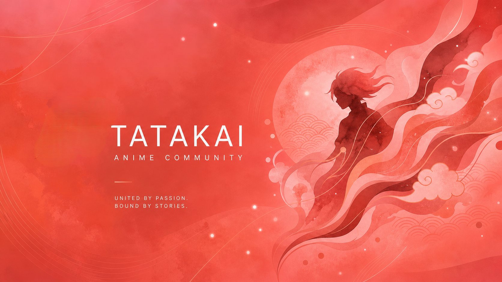
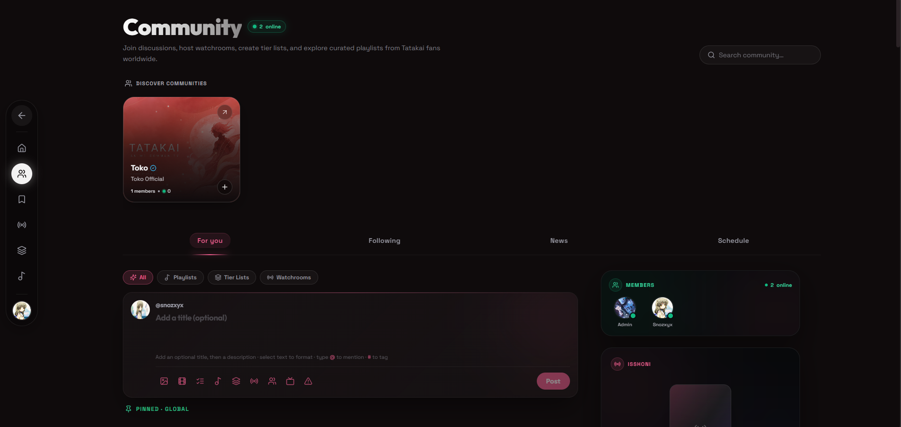
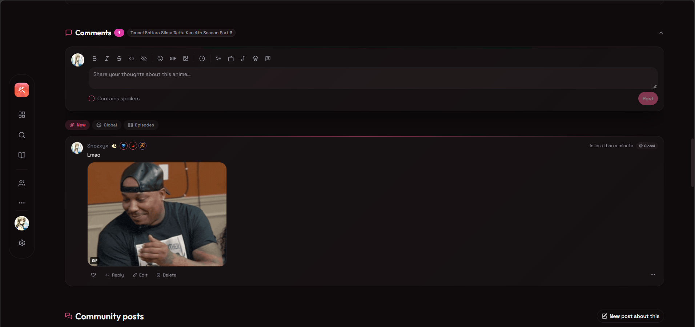
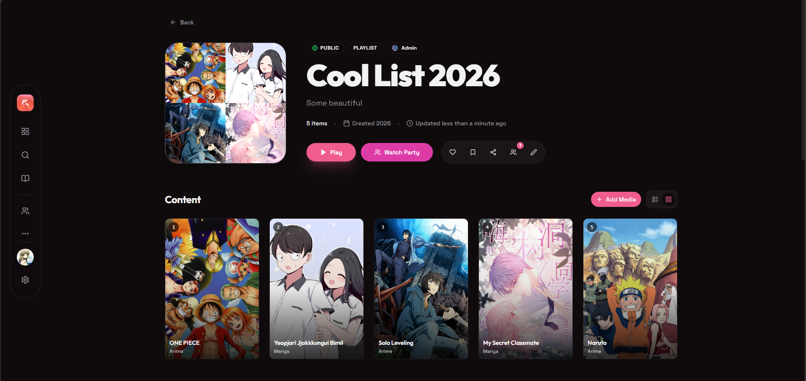
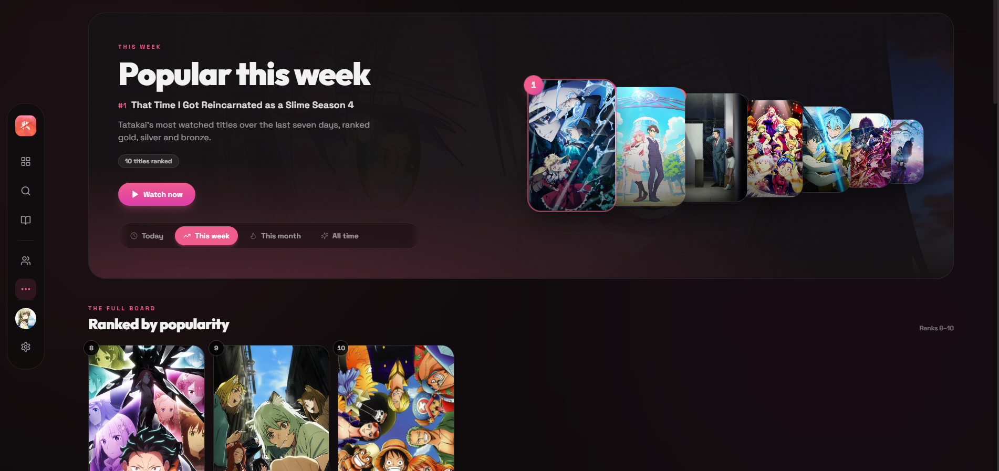
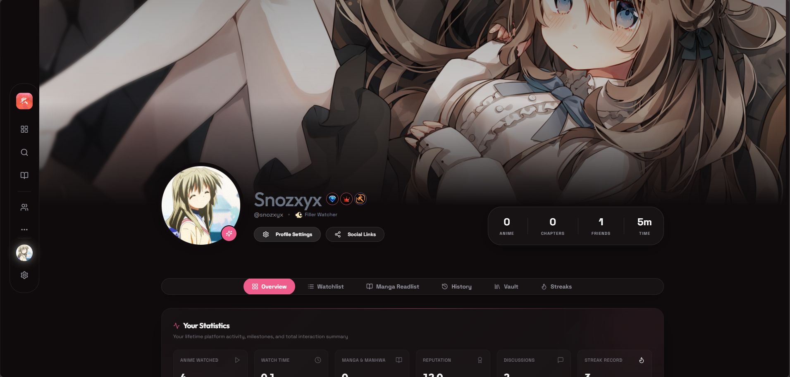
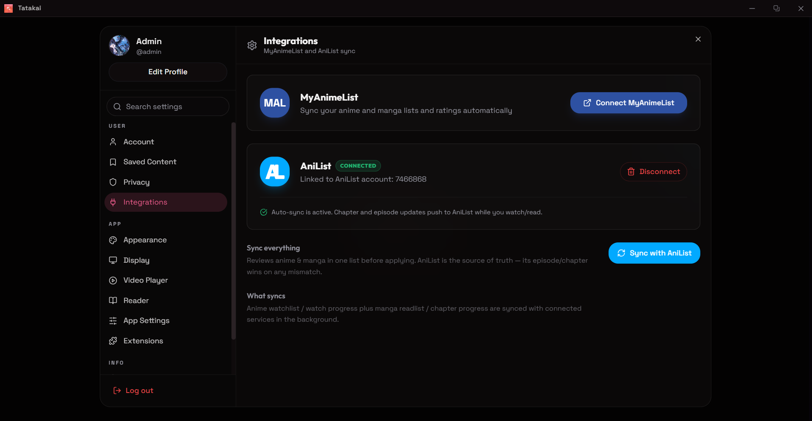

# Tatakai

  

  <h3>The next-generation anime streaming and manga platform</h3>

  

    A customizable, community-driven experience for discovering, watching, and reading.
    Available on web and desktop, with mobile apps planned.
  

  

    <a href="https://dsc.gg/tatakai">💬 Join our Discord</a>
    ·
    <a href="https://github.com/snozxyx/tatakaiapi">TatakaiAPI</a>
    ·
    <a href="https://github.com/snozxyx/tatakai/issues">Report an issue</a>
  

  

    
    
    
    
    
  

---

## Contents

- [Overview](#overview)
- [Platforms](#platforms)
- [Features](#features)
- [Showcase](#showcase)
- [Ranks and progression](#ranks-and-progression)
- [Community showcase](#community-showcase)
- [Roadmap](#roadmap)
- [API](#api)
- [Maintainers and support](#maintainers-and-support)
- [Legal and license](#legal-and-license)
- [AI disclosure](#ai-disclosure)

---

## Overview

Tatakai brings anime discovery, streaming, manga reading, and community features together in one customizable app. Its extension-first design lets users choose their sources instead of relying on hard-wired providers.

## Platforms

| Platform | Status |
| --- | --- |
| Web | Available |
| Desktop | Available |
| Android | Planned |
| iOS | Planned |
 | Android TV | Planned |

### Desktop downloads

Get installers from [GitHub Releases](https://github.com/snozxyx/tatakai/releases/latest):
pick `*-mac-arm64.dmg` for Apple Silicon (M1/M2/M3) or `*-mac-x64.dmg` for Intel Macs.

> **macOS note (certificate-less build):** Tatakai is ad-hoc signed for bundle
> integrity, but it is not Developer ID signed or notarized. After moving it to
> `/Applications`, approve the first launch in **System Settings → Privacy &
> Security → Open Anyway**, or run `xattr -cr /Applications/Tatakai.app` once.
> Tatakai checks for newer versions and shows a **Download manually** notice;
> download the latest DMG for your chip and replace the app in `/Applications`.

## Features

### Extensions

- Add anime and manga sources, as well as themes.
- Run multiple sources with priority-based routing.
- Community extensions are moderated before public availability.

### Discovery and search

- Personalized recommendations informed by watch and reading activity.
- Image-based anime search powered by [Trace.moe](https://trace.moe/).
- Unified manga search, homepage, and filters.

### Video player

- Adaptive quality and streaming up to 1080p where available.
- 4K support where available.
- Upload custom subtitles and switch subtitle tracks during playback.
- Background playback.

### Manga reader

- Read manga, manhwa, and comics.
- Per-device reader settings and custom keybinds.
- Reading progress that follows you across sessions.
- AniList and MyAnimeList sync.

### Offline access and torrents

- Stream torrents through the app.
- Download series for offline viewing or reading.

### Community

- Add fan-made video servers, moderated before public availability.
- Create and share tier lists.
- Watch together with Watch2Together.
- Discuss series in threaded, forum-style conversations.
- Create public or private playlists with custom ordering.
- Follow people and explore their profiles.
- View contribution leaderboards.

### Profiles and customization

- Activity heatmaps, taste breakdowns, and profile insights.
- Lite Mode for lower-powered devices.
- 25+ light and dark themes with accent options.

### Integrations

- Automatically sync with [MyAnimeList](https://myanimelist.net/) and [AniList](https://anilist.co/).

---

## Showcase

The video files are also available in [`public/assets/brand/`](public/assets/brand/).

### Discover — recommendations that get you

A hybrid recommendation engine learns from what you watch and read to surface your next pick.

<video controls muted playsinline preload="none" width="100%">
  <source src="https://raw.githubusercontent.com/snozxyx/tatakai/main/public/assets/brand/Recommendation.mp4" type="video/mp4" />
  Your browser does not support embedded video.
</video>

[Open or download the MP4](https://raw.githubusercontent.com/snozxyx/tatakai/main/public/assets/brand/Recommendation.mp4)

### Watch — a player built for how you watch

Upload subtitles, switch tracks mid-scene, and keep playing in the background.

<video controls muted playsinline preload="none" width="100%">
  <source src="https://raw.githubusercontent.com/snozxyx/tatakai/main/public/assets/brand/Videoplayer.mp4" type="video/mp4" />
  Your browser does not support embedded video.
</video>

[Open or download the MP4](https://raw.githubusercontent.com/snozxyx/tatakai/main/public/assets/brand/Videoplayer.mp4)

### Read — a fast, comic-style manga reader

Set per-device preferences, customize keybinds, and keep your reading progress across sessions.

<video controls muted playsinline preload="none" width="100%">
  <source src="https://raw.githubusercontent.com/snozxyx/tatakai/main/public/assets/brand/MangaReader.mp4" type="video/mp4" />
  Your browser does not support embedded video.
</video>

[Open or download the MP4](https://raw.githubusercontent.com/snozxyx/tatakai/main/public/assets/brand/MangaReader.mp4)

### Offline access and torrents — take it anywhere

Stream torrents through the app or download series for offline access.

<video controls muted playsinline preload="none" width="100%">
  <source src="https://raw.githubusercontent.com/snozxyx/tatakai/main/public/assets/brand/Torrent.mp4" type="video/mp4" />
  Your browser does not support embedded video.
</video>

[Open or download the torrent preview](https://raw.githubusercontent.com/snozxyx/tatakai/main/public/assets/brand/Torrent.mp4)

<video controls muted playsinline preload="none" width="100%">
  <source src="https://raw.githubusercontent.com/snozxyx/tatakai/main/public/assets/brand/Animedownload.mp4" type="video/mp4" />
  Your browser does not support embedded video.
</video>

[Open or download the anime download preview](https://raw.githubusercontent.com/snozxyx/tatakai/main/public/assets/brand/Animedownload.mp4)

<video controls muted playsinline preload="none" width="100%">
  <source src="https://raw.githubusercontent.com/snozxyx/tatakai/main/public/assets/brand/Mangadownload.mp4" type="video/mp4" />
  Your browser does not support embedded video.
</video>

[Open or download the manga download preview](https://raw.githubusercontent.com/snozxyx/tatakai/main/public/assets/brand/Mangadownload.mp4)

### Extensions — your sources, your way

Choose your sources, customize the app with themes, and run multiple extensions at once.

<video controls muted playsinline preload="none" width="100%">
  <source src="https://raw.githubusercontent.com/snozxyx/tatakai/main/public/assets/brand/extension.mp4" type="video/mp4" />
  Your browser does not support embedded video.
</video>

[Open or download the MP4](https://raw.githubusercontent.com/snozxyx/tatakai/main/public/assets/brand/extension.mp4)

### Profile and stats — your taste, in numbers

Explore activity heatmaps, taste breakdowns, and insights based on your history.

<video controls muted playsinline preload="none" width="100%">
  <source src="https://raw.githubusercontent.com/snozxyx/tatakai/main/public/assets/brand/Profile_with_stats.mp4" type="video/mp4" />
  Your browser does not support embedded video.
</video>

[Open or download the MP4](https://raw.githubusercontent.com/snozxyx/tatakai/main/public/assets/brand/Profile_with_stats.mp4)

---

## Ranks and progression

One unified rank grows as you watch and read. Anime, manga, manhwa, and comics all contribute to your score. There are 16 tiers, each with its own effect.

  
  
  
  
  
  
  
  
  
  
  
  
  
  
  
  

Ranks use a weighted RP score, collectible badges, and contributor leaderboards.

## Community showcase

  
  

  
  

  
  

---

## Roadmap

- Mobile apps for Android and iOS — high priority.

## API

Tatakai uses [TatakaiAPI](https://github.com/snozxyx/tatakaiapi).

If you find the project useful, please consider starring the API repository.

## Maintainers and support

- **Primary maintainer:** Snozxyx
- **Secondary maintainer:** GabhastiGiri
- **Discord:** [Join the community](https://dsc.gg/tatakai)
- **Issues and feature requests:** [Open a GitHub issue](https://github.com/snozxyx/tatakai/issues)
- **Contact:** [snozxyx@gmail.com](mailto:snozxyx@gmail.com)

Discord is currently the only official social channel. Please report accounts on other social platforms claiming to represent Tatakai.

For security concerns, contact the maintainers privately rather than posting sensitive details in a public issue.

## Legal and license

> [!IMPORTANT]
>Tatakai does not provide, host, or distribute any media content. Users are responsible for obtaining media through legal means and complying with their local laws. Extensions listed on the app are unaffiliated with Tatakai and may be removed if they violated copyright laws. </strong>

Tatakai does not host anime content on its servers or claim ownership of the content displayed. Content is sourced from third-party platforms through scraping, extensions, and public APIs. Third-party content and services remain subject to their respective owners' rights and terms.

Tatakai is a non-commercial, educational frontend project. For legal or content-related concerns, contact [snozxyx@gmail.com](mailto:snozxyx@gmail.com).

Tatakai is licensed under the [Mozilla Public License 2.0](LICENSE). Please read the license before modifying or redistributing the project.

> **Licensing note:** The MPL-2.0 does not itself prohibit commercial use or require an entire combined project to be open source. If a no-sale or broader open-source requirement is intended, it needs separate, legally reviewed terms; it is not a restriction imposed by the MPL-2.0 alone.

## AI disclosure

This project uses AI. Read the [AI disclaimer](docs/reference/ai-disclaimer.md).

---

## Star History

  <em>Created for anime fans, by an anime fan.</em>

